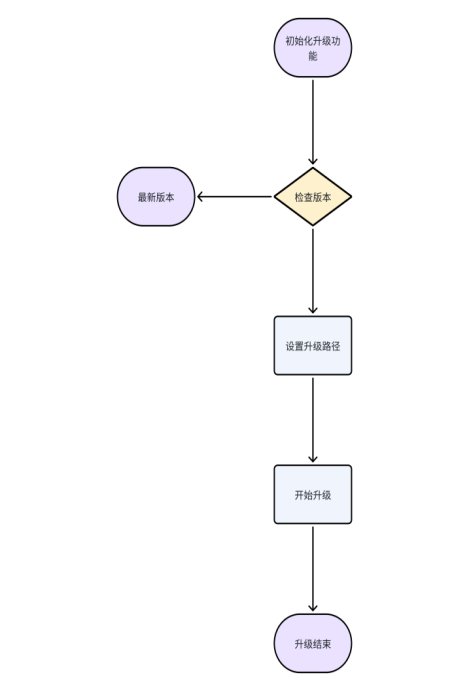
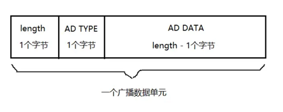
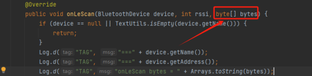

# Android SDK documentation

## 一、Introduction to documentation

### Purpose of documentation

In order to facilitate the secondary development of Android APP and ring communication, the communication protocol is specially encapsulated to achieve conciseness and clarity, so that developers do not need to pay attention to the communication layer with the ring, and focus on the development of business logic interaction level.

### Scope of application

This SDK is based on Android native development, and is finally provided as a jar package library. It can be used in the Android environment  
**Note: THE DEVELOPMENT LANGUAGE USED IS JAVA**

### Function introduction

<table>
<thead>
<tr>
<th align="left">Functional modules</th>
<th align="left">illustrate</th>
<th align="left">Related Documentation</th>
</tr>
</thead>
<tbody><tr>
<th align="left" rowspan="3" nowrap="nowrap">Bluetooth basic module</th>
<td align="left">Bluetooth switch operation</td>
<td align="left"></td>
</tr>
<tr>
<td align="left">Bluetooth's search connection operation</td>
<td align="left"></td>
</tr>
</tr>
<tr>
<td align="left">Bluetooth data is written to listen</td>
<td align="left"></td>
</tr>
<tr>
<th align="left" rowspan="13" nowrap="nowrap">Communication protocol module</th>
<td align="left">time management</td>
<td align="left"></td>
</tr>
<tr>
<td align="left">Version management</td>
<td align="left"></td>
</tr>
<tr>
<td align="left">Power management</td>
<td align="left"></td>
</tr>
<tr>
<td align="left">Step management</td>
<td align="left"></td>
</tr>
<tr>
<td align="left">System settings</td>
<td align="left"></td>
</tr>
<tr>
<td align="left">Acquisition cycle settings</td>
<td align="left"></td>
</tr>
<tr>
<td align="left">Heart rate measurement</td>
<td align="left"></td>
</tr>
<tr>
<td align="left">Blood oxygen measurement</td>
<td align="left"></td>
</tr>
<tr>
<td align="left">Heart rate variability measurements</td>
<td align="left"></td>
</tr>
<tr>
<td align="left">History management</td>
<td align="left"></td>
</tr>
<tr>
<td align="left">Blood pressure measurement</td>
<td align="left"></td>
</tr>
<tr>
<td align="left">Bluetooth name setting</td>
<td align="left"></td>
</tr>
<tr>
<td align="left">Voice recording</td>
<td align="left"></td>
</tr>
<tr>
</tbody></table>

## 二、Quick Start overview

### Preconditions

* Android system environment, system version >=5.0
* Bluetooth 5.0 must be supported
* The language used must be able to call the jar package

### Use the process

Use the SDK as follows:   
Step 1: Integrate the SDK    
Step 2: Initialize the SDK  
Step 3: Use the SDK  

### flow chart


## 三、Integrate the ChipletRing APP SDK

### 1.Integrate the ChipletRing APP SDK

#### 1.1 Integration

##### 1.1.1 Obtain the jar file of the ChipletRing APP SDK

##### 1.1.2 Place the jar package in the libs directory

##### 1.1.3 Right-click to Add as Library


##### 1.1.4 Configure the required permissions, if you need to store and other permissions, you can configure them yourself, involving dynamic permissions, and you need to do relevant processing    

Add the following code to your Manifest.xml

```xml
<uses-permission android:name="android.permission.BLUETOOTH_ADVERTISE" />
<uses-permission android:name="android.permission.BLUETOOTH_CONNECT" />
<uses-permission android:name="android.permission.BLUETOOTH_SCAN" />
<uses-permission android:name="android.permission.ACCESS_COARSE_LOCATION" />
<uses-permission android:name="android.permission.ACCESS_FINE_LOCATION" />
```

### 2.Initialize the ChipletRing APP SDK

#### 2.1.1 Initialize in the onCreate method of Application

```java
LmAPI.init(this);
LmAPI.setDebug(true);
```

#### 2.1.2 In the BaseActivity class, enable Listener which is used to listen for Bluetooth connection status and data fed back by the ring's base commands

```java
LmAPI.addWLSCmdListener(this, this);
// Monitor the status of the Bluetooth device connected to the APP
IntentFilter intentFilter = new IntentFilter();
intentFilter.addAction(BluetoothAdapter.ACTION_STATE_CHANGED);
intentFilter.addAction(BluetoothDevice.ACTION_ACL_DISCONNECTED);
intentFilter.addAction(BluetoothDevice.ACTION_ACL_CONNECTED);
registerReceiver(broadcastReceiver,intentFilter);

//Before using Bluetooth, apply for permission to go
if (Build.VERSION.SDK_INT >= Build.VERSION_CODES.S) {
    if (!checkPermissions(new String[]{Manifest.permission.ACCESS_COARSE_LOCATION, Manifest.permission.ACCESS_FINE_LOCATION, Manifest.permission.BLUETOOTH_SCAN, Manifest.permission.BLUETOOTH_CONNECT, Manifest.permission.BLUETOOTH_ADVERTISE})) {
        new XPopup.Builder(this).asConfirm(getRsString(R.string.hint), getString(R.string.localtion_auth),
                new OnConfirmListener() {
                    @Override
                    public void onConfirm() {
                        requestPermission(new String[]{Manifest.permission.ACCESS_COARSE_LOCATION, Manifest.permission.ACCESS_FINE_LOCATION, Manifest.permission.BLUETOOTH_SCAN, Manifest.permission.BLUETOOTH_CONNECT, Manifest.permission.BLUETOOTH_ADVERTISE}, 100);
                    }
                }).show();
        return;
    }

} else {
    if (!checkPermissions(new String[]{Manifest.permission.ACCESS_COARSE_LOCATION, Manifest.permission.ACCESS_FINE_LOCATION})) {
        new XPopup.Builder(this).asConfirm(getRsString(R.string.hint), getString(R.string.localtion_auth),
                new OnConfirmListener() {
                    @Override
                    public void onConfirm() {
                        requestPermission(new String[]{Manifest.permission.ACCESS_COARSE_LOCATION, Manifest.permission.ACCESS_FINE_LOCATION}, 100);
                    }
                }).show();
        return;
    }
}
```

**Note: If you repeatedly call the listener LmAPI.addWLSCmdListener(this, this), the phenomenon will be repeated**

### 3、Use the ChipletRing APP SDK

#### 3.1 Bluetooth Operation (BLEUtils)）

This class is a public class that uses Bluetooth to search, connect, and disconnect, all fed back by the IResponseListener interface. or a separate interface (will be explained)

##### 3.1.1 Search for the device

Interface function: Turn on the Bluetooth search function to search for surrounding Bluetooth devices.
Interface Declaration:

```java
BLEUtils.startLeScan(Context context, BluetoothAdapter.LeScanCallback leScanCallback);
```

Parameter description:context：context     leScanCallback：Callbacks for Bluetooth searches  
Return value

```jave
（void onLeScan(BluetoothDevice device, intrssi, byte[] bytes)）
```

The return value of this API is described as follows:

```java
private BluetoothAdapter.LeScanCallback leScanCallback = new BluetoothAdapter.LeScanCallback() {

    @Override
    public void onLeScan(BluetoothDevice device, int rssi, byte[] bytes) {
        //Handle the searched devices
    }
};
```

Precautions: 1. Make sure the Bluetooth device is powered  
2.If you want to filter Bluetooth devices (manufacturer ID == 0xFF01), please refer to 4. Others

##### 3.1.2 Stop searching

Interface function: Turn off the Bluetooth search function.  
Interface Declaration:

```java
BLEUtils.stopLeScan(Context context, BluetoothAdapter.LeScanCallback leScanCallback);
```

Note: To call this interface, you need to ensure that it is connected to the ring  
Parameter description:context：context    leScanCallback：Callbacks for Bluetooth searches  
Return value: None

##### 3.1.3 Connect the device

Interface function: initiate the connection to a Bluetooth device.
Interface Declaration:

```java
BLEUtils.connectLockByBLE(Context context, BluetoothDevice bluetoothDevice);
```

Note: 1. To call this interface, you need to ensure that it is connected to the ring  
2.When scanning the connection, it will automatically determine whether it is a persistent connection, and when you reconnect after a long connection, you need to manually enter the BOOL value to confirm whether it is reconnected (there is an example in the demo)  
Parameter description:context：context 
bluetoothDevice ：Bluetooth devices  
Return value:

```java
@Override
public void lmBleConnecting(int code) {
    //Connecting
}

@Override
public void lmBleConnectionSucceeded(int code) {
    //The connection is successful
}

@Override
public void lmBleConnectionFailed(int code) {
    //The connection failed
}
```

##### 3.1.4 Disconnect Bluetooth

Interface function: disconnect the device.  
Interface Declaration:

```java
BLEUtils.disconnectBLE(Context context);
```

Note: To call this interface, you need to ensure that it is connected to the ring  
Parameter description:context：context  
Return value: None

#### 3.2 Command function（LmAPI）

This class is a public class that uses the ring function, and the function of the ring can be called directly through this class, and the data feedback is unified by the IResponseListener interface except for special instructions

##### 3.2.1 Synchronization time

Interface function: synchronize time, call this interface, it will get the current time of the mobile phone to synchronize to the ring, keep the time synchronized.  
Interface Declaration:

```java
LmAPI.SYNC_TIME();
```

Note: The synchronization time and the read time share the same return value. To call this interface, you need to ensure that it is connected to the ring  
Parameter description: None    
Return value

```java
（void syncTime(byte datum,byte[] time)）
```

| The name of the parameter | type   | Example values | illustrate                        |
| -------- | ------ | ------ | --------------------------- |
| datum    | byte   | 0或1   | 0 indicates that the synchronization is successful, and 1 indicates the read time |
| time     | byte[] | null   | Sync time does not return byte[]      |

##### 3.2.2 Read time

Interface function: read time, call this interface, will get the current time of the ring.  
Interface Declaration:  
Note: The synchronization time and the read time share the same return value. To call this interface, you need to ensure that it is connected to the ring   
Parameter description: None

```java
LmAPI.READ_TIME();
```

Return value

```java
（void syncTime(byte datum,byte[] time)）
```

| The name of the parameter | type   | Example values   | illustrate        |
| -------- | ------ | --------------------------------------------------- | ------------------------------------------------------ |
| datum    | byte   | 0 or 1                                                | 0 indicates that the synchronization is successful, and 1 indicates the read time
| time     | byte[] | [48, -23, -1, 83, -111, 1, 0, 0, 8] = 1723691166000 | If the reading time is successful, it needs to be converted to a timestamp (little-endian mode, the last digit is the time zone) |

##### 3.2.3 Version information

API function: version information, get the version information of the ring.  
Interface Declaration:

```java
LmAPI.GET_VERSION((byte) 0x00);  //0x00 get the software version, 0x01 get the hardware version
```

Note: To call this interface, you need to ensure that it is connected to the ring    
Parameter description: type:0x00 to get the software version, 0x01 to get the hardware version  
Return value

```java
（void VERSION(byte type, String version)）
```

| The name of the parameter | type   | Example values  | illustrate                            |
| -------- | ------ | ------- | ------------------------------- |
| type     | byte   | 0 or 1    | 0 represents the software version number, and 1 represents the hardware version number |
| version  | String | 1.0.0.1 | Version number                          |

##### 3.2.4 Battery level

Interface function: get battery level, battery status.  
Interface Declaration:

```java
LmAPI.GET_BATTERY((byte) 0x00);  //0x00 get the power, 0x01 get the state of charge
```

Note: To call this interface, you need to ensure that it is connected to the ring   
Parameter description: type: 0x00 to obtain the power level, 0x01 to obtain the charging status  
Return value

```java
（void battery(byte status, byte datum)）
```

| The name of the parameter | type | Example values | illustrate                        |
| -------- | ---- | ------ | --------------------------- |
| status   | byte | 0 or 1   | 0 represents battery level and 1 represents state of charge |
| datum    | byte | 0-100  | Electricity                        |

##### 3.2.5 Read the number of steps

API function: Get the cumulative number of steps of the day.  
Interface Declaration:

```java
LmAPI.STEP_COUNTING（）
```

Note: To call this interface, you need to ensure that it is connected to the ring    
Parameter description: None  
Return Value

```java
（void stepCount(byte[] bytes, byte subCmd)）
```

| The name of the parameter | Type   | Example values | illustrate                                  |
| -------- | ------ | ------ | ------------------------------------- |
| bytes    | byte[] | 3303   | Step 819 (little-endian mode, obtained from 0333 to decimal) |
| subCmd   | byte   | 0，1   | 0 represents the number of steps, and 1 represents the successful clearing of the number of steps           |

##### 3.2.6 Clear the number of steps

Interface function: clear the number of steps.  
Interface Declaration:

```java
LmAPI.CLEAR_COUNTING（）
```

Note: To call this interface, you need to ensure that it is connected to the ring  
Parameter description: None   
Return value: Refer to the preceding paragraph

##### 3.2.7 Factory reset

Interface function: factory reset  
Interface Declaration:

```java
LmAPI.RESET（）
```

Note: To call this interface, you need to ensure that it is connected to the ring  
Parameter description: None   
Return value: None, if there is a callback reset method, it is considered successful

##### 3.2.8 Acquisition cycle settings

Interface function: collection cycle setting  
Interface Declaration:

```java
LmAPI.SET_COLLECTION（collection）//Acquisition period, in seconds
```

Note: To call this interface, you need to ensure that it is connected to the ring  
Parameter description: colection: collection interval in seconds  
Return value:

```java
(void collection(byte[] bytes, byte subCmd))
```

| The name of the parameter | type   | Example values   | illustrate                        |
| -------- | ------ | -------- | --------------------------- |
| bytes    | byte[] | b0040000 | 1200 S                      |
| subCmd   | byte   | 0，1     | 0 indicates that the setting is successful, and 1 indicates that the setting fails |

##### 3.2.9 Acquisition cycle reads

Interface function: acquisition cycle reading  
Interface Declaration:

```java
LmAPI.GET_COLLECTION（）//Acquisition period, in seconds
```

Note: To call this interface, you need to ensure that it is connected to the ring  
Parameter description: None   
Return value:

```java
(void collection(byte[] bytes, byte subCmd))
```

| The name of the parameter | type   | Example values   | illustrate                            |
| -------- | ------ | -------- | ------------------------------- |
| bytes    | byte[] | b0040000 | Acquisition time interval in seconds, such as: 1200s |
| subCmd   | byte   | 0，1     | 0 indicates that the setting is successful, and 1 indicates that the setting fails     |

##### 3.2.10 Measure your heart rate

Interface function: Measure heart rate.  
Interface Declaration:

```java
LmAPI.GET_HEART_ROTA（byte waveForm, byte acqTime,IHeartListener iHeartListener）
```

Note: To call this interface, you need to ensure that it is connected to the ring  
Parameter description:  
waveForm：Whether to configure waveform 0 not to upload 1 to upload  
acqTime：Acquisition time (byte)30 is the normal time, 0 is the continuous collection  
iHeartListener:  This interface is a listener for measurement data  
Return value:

```java
 LmAPI.GET_HEART_ROTA((byte) 0x01, (byte)0x30, new IHeartListener() {
     @Override
     public void progress(int progress) {
         setMessage("Heart rate is being measured..." + String.format
("%02d%%", progress));
     }
 
     @Override
     public void resultData(int heart, int heartRota, int yaLi, int temp) {
         if (colorFragment != null) {
             colorFragment.heartAndRota(heart, heartRota, yaLi, temp);
         }
     }
     @Override
     public void waveformData(byte seq, byte number, String waveData) {
                  //Heart rate returns to the waveform data analysis：waveData
           }

     @Override
     public void error(int value) {
         switch (value) {
             case 0:
                 dismissProgressDialog();
                 ToastUtils.show("Not worn");
                 break;
             case 2:
                 dismissProgressDialog();
                 ToastUtils.show("Acquisition is not allowed during charging");
                 break;
             case 4:
                 dismissProgressDialog();
                 ToastUtils.show("Busy, not performing");
                 break;
             default:
                 break;
         }
     }
 
     @Override
     public void success() {
         dismissProgressDialog();
     }
 });
```

##### 3.2.11 Blood oxygen is measured

Interface function: Measure blood oxygen.  
Interface Declaration:

```java
LmAPI.GET_HEART_Q2（byte waveForm,IQ2Listener iQ2Listener）
```

Note: To call this interface, you need to ensure that it is connected to the ring  
Parameter description:  
waveForm：Whether to configure waveform 0 not to upload 1 to upload  
IQ2Listener: This interface is a listener for measurement data  
Return value:

```java
LmAPI.GET_HEART_Q2(new IQ2Listener() {
    @Override
    public void progress(int progress) {
        setMessage("Blood oxygen is being measured..." + String.format("%02d%%", progress));
    }
    @Override
    public void resultData(int heart, int q2, int temp) {
        if (colorFragment != null) {
            colorFragment.updateData(heart, q2, temp);
        }
    }

    @Override
    public void waveformData (byte seq, byte number, String waveData) {
                //Analysis of blood oxygen return waveform data：waveData
    }
    @Override
    public void error(int value) {
        switch (value) {
            case 0:
                dismissProgressDialog();
                ToastUtils.show("Not worn");
                break;
            case 2:
                dismissProgressDialog();
                ToastUtils.show("Acquisition is not allowed during charging");
                break;
            case 4:
                dismissProgressDialog();
                ToastUtils.show("Busy, not performing");
                break;
            default:
                break;
        }
    }

    @Override
    public void success() {
        dismissProgressDialog();
    }
});
```

##### 3.2.12 Measure the temperature

Interface function: Temperature measurement.  
Interface Declaration:

```java
LmAPI.GET_HEART_Q2（IQ2Listener iQ2Listener）
```

Note: To call this interface, you need to ensure that it is connected to the ring  
Parameter description:IQ2Listener: This interface is a listener for measurement data  
Return value:Ditto. When the blood oxygen is measured, the temperature is returned at the same time

##### 3.2.13 History management

Interface function: Read history.  
Interface Declaration:

```java
LmAPI.READ_HISTORY（int type,IHistoryListener iHistoryListener）
```

Note: To call this interface, you need to ensure that it is connected to the ring  
Parameter description:type: 1, get all history; 0 to get the history that has not been uploaded  
Return value:

```java
LmAPI.READ_HISTORY(type, new IHistoryListener() {
    @Override
    public void error(int code) {
        handler.removeMessages(0x99);
        dismissProgressDialog();
        switch (code) {
            case 0:
                ToastUtils.show("Measuring in progress, please try again later");
                break;
            case 1:
                ToastUtils.show("Uploading history, please try again later");
                break;
            case 2:
                ToastUtils.show("Deleting history, please try again later");
                break;
            default:
                break;
        }
    }

    @Override
    public void success() {
        //Synchronization is complete
    }

    @Override
    public void progress(double progress, com.lm.sdk.mode.HistoryDataBean dataBean) {
           //Process historical data
    }
});
```

##### 3.2.14 Clear historical data

Interface function: clear historical data.  
Interface Declaration:

```java
LmAPI.CLEAN_HISTORY（）
```

Note: To call this interface, you need to ensure that it is connected to the ring  
Parameter description: None   
Return value:no

##### 3.2.15 Blood pressure test algorithm

Interface function: clear historical data.  
Interface Declaration:

```java
LmAPI.GET_BPwaveData()
```

Note: The ring firmware must be supported, otherwise it cannot be used. To call this interface, you need to ensure that it is connected to the ring  
Parameter description: None   
Return value

```java
(byte seq,byte number,String waveDate)
```

| The name of the parameter | type   | Demonstration value                                                                            | illustrate       |
| -------- | ------ | ------------------| ---------- |
| seq      | byte   | 0                             | Serial number 0      |
| number   | byte   | 10         | There are 10 pieces of data |
| waveDate | String | green/绿光:14289393 ir/红外:10108995 cur_green/绿光电流:4704 cur_ir/红外电流:4704 | Light and current values |

##### 3.2.16 Real-time PPG blood pressure measurement

Interface function: real-time measurement of blood pressure value and 500Hz original waveform  
Interface Declaration:

```java
LmAPI.GET_REAL_TIME_BP（byte time,byte isWave,byte isProgress,IRealTimePPGBpListener iRealTimePPGBpListener）
```

Note: The ring firmware must be supported, otherwise it cannot be used. To call this interface, you need to ensure that it is connected to the ring  
Parameter description:  
time：Acquisition time, byte type, default 30s  
isWave:Whether to upload a waveform. 0: Not uploaded, 1: Uploaded  
isProgress：Whether or not to upload progress. 0: Not uploaded, 1: Uploaded

```java
LmAPI.GET_REAL_TIME_BP((byte) 0x30, (byte) 1, (byte) 1, new IRealTimePPGBpListener() {
                    @Override
                    public void progress(int progress) {
                        //progress
                    }

                    @Override
                    public void bpResult(byte type) {
                        //[0]:Diastolic blood pressure
                        //[1]:Systolic blood pressure
                    }

                    @Override
                    public void resultData(String bpData) {
                        //bpData contains the infrared value
                    }
             });
```

##### 3.2.17 Real-time PPG blood pressure stop collection

Interface function: stop acquisition  
Interface Declaration:

```java
LmAPI.STOP_REAL_TIME_BP()
```

Parameter description: None   
Callback:

```java
 @Override
    public void stopRealTimeBP(byte isSend) {
        if(isSend == (byte)0x01){
            Logger.show("TAG","Stop Acquisition Sent");
        }
  }
```

##### 3.2.18 Set the Bluetooth name

Interface function: Set the Bluetooth name  
Interface Declaration:

```java
LmAPI.Set_BlueTooth_Name(String name)
```

Parameter description:  
Name:Bluetooth name, no more than 12 bytes, can be Chinese, English, numbers, that is, 4 Chinese characters or 12 English  
Note: After setting the Bluetooth name, the broadcast will not change immediately, and you need to wait for a while  
Callback:

```java
@Override
    public void setBlueToolName(byte data) {
        if(data == (byte)0x00){
            Logger.show("TAG","The setup failed");
        }else if(data == (byte)0x01){
            Logger.show("TAG","The setup was successful");
        }
  }
```

##### 3.2.19 Get the Bluetooth name

Interface function: Set the Bluetooth name  
Interface Declaration:

```java
LmAPI.Get_BlueTooth_Name()
```

Parameter description: None   
Callback:

```java
@Override
    public void readBlueToolName(byte len, String name) {
        Logger.show("TAG","Bluetooth name length：" + len + " Bluetooth Name:" + name);
  }
```

##### 3.2.20 Heart rate measurement stops

Interface function: Stop the heart rate that is being measured  
Interface Declaration:

```java
LmAPI.STOP_HEART()
```

Parameter description: None   
Callback:

```java
@Override
    public void stopHeart(byte data) {
        Logger.show("TAG","stop success");
  }
```

##### 3.2.21 Blood oxygen measurement stopped

Interface function: Stop the blood oxygen being measured  
Interface Declaration:

```java
LmAPI.STOP_Q2()
```

Parameter description: None   
Callback:

```java
@Override
    public void stopQ2(byte data) {
        Logger.show("TAG","stop success");
  }
```

##### 3.2.22 Get status with one click

Interface function: One-click access to the functions supported by the system, simplified version of the interface collection, will return the power level, firmware version, collection cycle, etc  
Interface Declaration:

```java
LmAPI.SYSTEM_CONTROL()
```

Parameter description: None   
Callback:

```java
@Override
    public void SystemControl(SystemControlBean systemControlBean) {
        postView("\nSystemControl："+systemControlBean.toString());
  }
```

##### 3.2.23 Voice recording

Interface function: record voice  
Interface Declaration:

```java
LmAPI.SET_AUDIO(byte data)
```

Parameter description:0 is closed and 1 is open   
Callback:

```java
@Override
    public void CONTROL_AUDIO(short[] bytes) {
        postView("\nAudio results：" + Arrays.toString(bytes));
  }
```

**Note: The returned data is a signed short integer**

#### 3.3 Firmware upgrades（OTA）

   
**Note: This is a phyOTA process, and other chips use the official library**

[Nordic Android library link](https://github.com/NordicSemiconductor/Android-DFU-Library)

[Nordic ios library link](https://github.com/NordicSemiconductor/IOS-DFU-Library)

##### 3.3.1 Check the version

Interface function: Check whether the firmware version is up-to-date.  
Interface Declaration:

```java
OtaApi.checkVersion(String version, VersionCallback versionCallback);
```

Note: To call this interface, you need to ensure that it is connected to the ring  
Parameter description:version：The version number of the current ring  
versionCallback：The latest version information callback   
Return value:

```java
OtaApi.checkVersion(version, new VersionCallback() {
    @Override
    public void success(String newVersion) {
    //newVersion：The latest version number in the cloud
        if (!StringUtils.isEmpty(newVersion)){
            //There is a new version
        }else{
            //It is the latest version
        }
    }

    @Override
    public void error() {
        //Failed to get the latest version
    }
});
```

##### 3.3.2 Start the upgrade

Interface function: Perform a firmware upgrade.  
Interface Declaration:

```java
void startUpdate(BluetoothDevice bluetoothDevice, int rssi, LmOTACallback otaCallback)
```

Note: To call this interface, you need to ensure that it is connected to the ring  
Parameter description:bluetoothDevice： The device that is currently being upgraded   
rssi：Device signal value  
otaCallback：Upgrade callbacks  
Return value:

```java
OtaApi.startUpdate(App.getInstance().getDeviceBean().getDevice(), App.getInstance().getDeviceBean().getRssi(), new LmOTACallback() {
    @Override
    public void onDeviceStateChange(int i) {
        //Device status callback
    }

    @Override
    public void onProgress(int i, int i1) {
        //Upgrade progress
    }

    @Override
    public void onComplete() {
        //The upgrade is complete
    }
});
```

#### 3.4 Database-related（DataApi）

##### 3.4.1 Query history

API function: query historical data at a specified time  
Interface Declaration:

```java
//Query historical data
List<HistoryDataBean> queryHistoryData(long dayBeginTime,long dayEndTime,String mac) 
//Historical data is queried in positive order by time
List<HistoryDataBean> queryHistoryDataOrderByTimeAsc(long dayBeginTime,long dayEndTime,String mac)
//Query historical data and perform flashbacks by number of steps
List<HistoryDataBean> queryHistoryDataOrderByStepCountDesc(long dayBeginTime,long dayEndTime,String mac)
```

Note: You need to enable the corresponding permissions  
Parameter description:dayBeginTime ：Start timestamp, in seconds  
dayEndTime ：End timestamp, in seconds  
mac ：The MAC address of the device  
Return value:

```java
public class HistoryDataBean{

    @Id
    private Long id;

    private String mac;
     //Total number of packets: 4 bytes
    private long totalNumber;
     // The current packets are 4 bytes
    private long indexNumber;
     // The current recording time is 4 bytes
    private long time;
     //Today's cumulative steps are 2 bytes
    private int stepCount;
     // Heart rate 1 byte
    private int heartRate;
     // Blood oxygen 1 byte
    private int bloodOxygen;
     //Heart rate variability 1 byte
    private int heartRateVariability;
     //Mental stress index 1 byte
    private int stressIndex;
     //Temperature 2 bytes
    private int temperature;
    //Intensity of movement 1 byte
    private int exerciseIntensity;
    /**
     * Sleep type: 1 byte
     * 0：invalid
     * 1：awake
     * 2：Light sleep
     * 3：Deep sleep
     * 4.Eye tracking phase
     */
    private int sleepType;
     // Reserve 2 bytes
    private int reserve;
     //RR interval 1 byte
    private int rrCount;
     //RR array Byte arrays
    private byte[] rrBytes;
 }
```

##### 3.4.2 Clear historical data

Interface function: Clear all historical data.  
Interface Declaration:

```java
void deleteHistoryData()；
```

Note: You need to enable the corresponding permissions  
Parameter description: None   
Return value:null

#### 3.5 Logical algorithm related（LogicalApi）

##### 3.5.1 Calculate distance, calories

Interface function: calculate distance and calories according to the number of steps.  
Interface Declaration:

```java
DistanceCaloriesBean calculateDistance(int stepCount,double height,double weight)；
```

Note: You need to enable the corresponding permissions  
Parameter description:stepCount：steps 
height：Height in cm  
weight：Weight in kg  
Return value:

```java
public class DistanceCaloriesBean {
    //Distance, in meters
    private double distance;
    //Calories, unit cards
    private double kcal;
}
```

##### 3.5.2 Calculate sleep data

Interface function: Calculate sleep data at a specified time.  
Interface Declaration:

```java
SleepBean calculateSleep(String date, String mac, int type)；
```

**Note: To calculate sleep time, you need to call the API to query historical data**  
Parameter description:date：Date, in the format of YYYY-MM-DD HH:mm:ss  
mac ：Device Bluetooth MAC  
type：Temporarily invalid  
Return value:

```java
public class SleepBean{
    //Sporadic hours of sleep
    int hours = 0;
    //Sporadic sleep minutes
    int minutes = 0;
    //All hours of sleep
    int allHours = 0;
    // All minutes of sleep
    int allMinutes =0;
    //Sleep hours
    int sleepHours = 0;
    //Sleep minutes
    int sleepMinutes =0;
    //Deep sleep time
    long highTime = 0;
    //Light sleep time
    long lowTime = 0;
    // Eye tracking time
    long ydTime = 0;
    //Awake time
    long qxTime = 0;
    //Sleep onset timestamp
    long startTime = 0;
    //Sober timestamps
    long endTime = 0;
    //Sleep data
    private List<HistoryDataBean> historyDataBeanList;
}
```

Data in the database

```java
public class HistoryDataBean{

    @Id
    private Long id;
    private String mac;
     // Total number of packets: 4 bytes
    private long totalNumber;
     // The current packets are 4 bytes
    private long indexNumber;
     // The current recording time is 4 bytes
    private long time;
     // Today's cumulative steps are 2 bytes
    private int stepCount;
     // Heart rate 1 byte
    private int heartRate;
     // Blood oxygen 1 byte
    private int bloodOxygen;
     // Heart rate variability 1 byte
    private int heartRateVariability;
     // Mental stress index 1 byte
    private int stressIndex;
     // Temperature 2 bytes
    private int temperature;
     // Intensity of movement 1 byte
    private int exerciseIntensity;
    /**
     * Sleep type: 1 byte
     * 0：invalid
     * 1：awake
     * 2：Light sleep
     * 3：Deep sleep
     * 4: Eye tracking phase
     */
    private int sleepType;
     // Reserve 2 bytes
    private int reserve;
     // RR interval 1 byte
    private int rrCount;
     // RR array data 
    private byte[] rrBytes;
 }
```

## 四、other

**Note: Before using the Ring API, you should check the status of your ring**

### 1、Filter relevant
The blood oxygen ring device is broadcast under the name XXXXXX. XXX is any character, and the broadcast interval is 500ms. In this example, XXX is BCL603.  
The length of the broadcast packet must be 31 bytes, if it is less than 31 bytes, then the rest is filled with 0 to complete, and this part of the data is invalid

#### 1.1 Broadcast data unit

A broadcast packet contains several broadcast data units, also known as AD Structure.  
Broadcast Data Unit = Length Value Length + AD type + AD Data  
The length value Length occupies only one byte and is located on the first byte of the broadcast data unit.  


##### 1.1.1 Raw data:

0x means that the string is a hexadecimal string. A two-digit hexadecimal number represents a byte. This is because the maximum value of a two-character hexadecimal string is FF, that is, 255, and the value of byte type in Java ranges from -128 to 127, which can just represent the size of 255. So two hexadecimal strings represent one byte.  
 Continue to view the contents of the message and start reading the first broadcast data unit. Read the first byte: 0x02, converted to decimal is 2, which means that the next 2 bytes are the data content of this broadcast data unit. After the data content exceeds these 2 bytes, it is indicated as a new broadcast data unit.  
 In the second broadcast data unit, the value of the first byte is 0x09, which is converted to decimal 9, which means that the next 9 bytes are the second broadcast data unit.  
In the third broadcast data unit, the value of the first byte is 0x03, which is converted to decimal system to 3, which means that the next 3 bytes are the third broadcast data unit.  
And so on.  
In the data part of the broadcast data unit, the first byte represents the data type (AD type), which determines what data the data part represents. (i.e. the second byte of the broadcast data unit is AD type)   


##### 1.1.2 Details:

(1)、Type = 0x01 indicates that the device is physically connected  
(2)、Type = 0xFF indicates vendor data. The first two bytes represent the vendor ID, that is, the vendor ID is 0xFF01. The following is the vendor data, which is defined by the user  
(3)、Type = 0x03 indicates the full 16-bit UUID. Its value is 0x0D18.  
(4)、Type = 0x09 indicates the full name of the device, for example, "BCL603" is converted 0x42434C363033 byte[] to byte[] and then to string. 

#### 1.2 apply

**Note: The data transmission mode is in little-endian mode**    


When you call the Bluetooth scan, you find the byte[] that is returned, which is specific here[2, 1, 6, 9, -1, 1, -1, -58, 0, 0, 17, 32, -78, 3, 3, 13, 24, 7, 9, 66, 67, 76, 54, 48, 51, 0, 0, 0, 0, 0, 0, 0, 0, 0, 0, 0, 0, 0, 0, 0, 0, 0, 0, 0, 0, 0, 0, 0, 0, 0, 0, 0, 0, 0, 0, 0, 0, 0, 0, 0, 0, 0]  
Note: byte data needs to be converted to hexadecimal  
If you know the format and meaning of the data, set the filter condition to Vendor ID == "FF01" according to the rule   
Or directly verify the received data "01FF"（``Subsequently, it may only be necessary to identify arr[1] as FF in the broadcast``）

##### 1.2.1 Broadcast the latest version

Added broadcast UUID[1], "0018", after broadcast FF01  
The new point is "0018", and the binary means 0000 0000 ''0001'' 1000 (little-endian mode), giving more meaning  
Interpretation:  
``bit[4:7]``：Protocol version number (i.e. binary 0001)  
0:The version of the one-click access status command is not supported.  
1:Support one-click access to the version of the status command.  

### 2、Problems that may be encountered

There is a simple demo in the data, you can check the logic of using the SDK for the simple demo first, and then develop it yourself

#### 2.1 Version-related

Gradle version. This can be changed in gradle-wrapper.properties  
```java
distributionBase=GRADLE_USER_HOME
distributionPath=wrapper/dists
distributionUrl=https\://services.gradle.org/distributions/gradle-8.0-all.zip
zipStoreBase=GRADLE_USER_HOME
zipStorePath=wrapper/dists
```

You can download the required version at the following URL, and put the zip in the corresponding path of wrapper/dists (put it in the random code folder, remember to clear the original content)，Resync it  
Gradle website available:[Gradle Distributions](https://services.gradle.org/distributions/)

#### 2.2 Gradle 4.0 or later causes Xpopup to not work issue

Xpopup is a third-party pop-up framework, and replacing it with a normal pop-up window can solve the problem

#### 2.3 There is no need to use the interface

ringSDK1.0.2 already supports functions such as scanning and connecting in the service without the need for an interface  
**Note: Subsequent updates are not specific to this development, and can be updated specifically if needed**

#### 2.4 OTA class reference not found
The following may occur:   


This is the official other dependency library, if you can't find it, you can open the demo, the original jar package has been put into the OTA class folder of the SDK

### 3、Hardware, algorithm, logic, or firmware

#### 3.1 Ring-related

Q: How often does the ring store data?  
A: 5 minutes  
Q: Will the OTA update erase the data?  
A: Yes  
Q: The data in the ring can be stored for a few days  
A: 7 days, automatically covered after 7 days  
Q: Does a factory reset restore only the ring?  
A: Yes, only for ring hardware

#### 3.2 Algorithmic related

Q: Why does the heart rate/blood oxygen measurement always show a timeout when using the SDK?  
A: When the ring is charging, heart rate blood oxygen measurement cannot be performed

#### 3.3 Sleep logic diagrams


#### 3.4 Nap logic diagram


### 4、Q&A

Q: In the process of reading history, do I report that one tag has been synchronized, or is all tags uploaded?  
A: One by one  
Q: What are the restrictions on the collection cycle setting?  
A: The collection period is in seconds, and the normal value is at least 60s, and when it is 0, the collection is disabled.