# 安卓SDK说明文档 
*每次替换新的aar时首先要Sync Project with Gradle Files*
## 一、文档简介
### 1.文档目的
提供SDK为开发者将智能戒指的功能移植进自己的APP。本SDK对低功耗蓝牙、智能戒指通讯协议、生理算法进行了封装，使开发者更加专注产品的业务逻辑和交互的开发。
### 2.适用范围
具有智能穿戴APP需求的安卓开发工程师，测试工程师，产品经理。  
### 3.API列表
<table>
<thead>
<tr>
<th align="left">功能模块</th>
<th align="left">说明</th>
<th align="left">API</th>
</tr>
</thead>
<tbody><tr>
<th align="left" rowspan="3" nowrap="nowrap">低功耗蓝牙</th>
<td align="left">打开关闭</td>
<td align="left"></td>
</tr>
<tr>
<td align="left">发现设备</td>
<td align="left"></td>
</tr>
</tr>
<tr>
<td align="left">读写特征值(数据收发)</td>
<td align="left"></td>
</tr>
<tr>
<th align="left" rowspan="16" nowrap="nowrap">戒指通讯协议</th>
<td align="left">时间管理</td>
<td align="left"></td>
</tr>
<tr>
<td align="left">版本管理</td>
<td align="left"></td>
</tr>
<tr>
<td align="left">电量管理</td>
<td align="left"></td>
</tr>
<tr>
<td align="left">步数管理</td>
<td align="left"></td>
</tr>
<tr>
<td align="left">系统设置</td>
<td align="left"></td>
</tr>
<tr>
<td align="left">采集周期设置</td>
<td align="left"></td>
</tr>
<tr>
<td align="left">心率测量</td>
<td align="left"></td>
</tr>
<tr>
<td align="left">血氧测量</td>
<td align="left"></td>
</tr>
<tr>
<td align="left">心率变异性测量</td>
<td align="left"></td>
</tr>
<tr>
<td align="left">历史记录管理</td>
<td align="left"></td>
</tr>
<tr>
<td align="left">血压测量</td>
<td align="left"></td>
</tr>
<tr>
<td align="left">蓝牙名称设置</td>
<td align="left"></td>
</tr>
<tr>
<td align="left">语音录制</td>
<td align="left"></td>
</tr>
<tr>
<td align="left">HID功能</td>
<td align="left"></td>
</tr>
<tr>
<td align="left">获取RSSI</td>
<td align="left"></td>
</tr>
 <tr>
<td align="left">二代协议</td>
<td align="left"></td>
</tr>
<tr>
<th align="left">心电图</th>
<td align="left"></td>
</tr>
<tr>
<th align="left">OTA升级</th>
<td align="left"></td>
</tr>
 <tr>
<th align="left">升级服务</th>
<td align="left"></td>
</tr>
<tr>
</tbody></table>

详细说明参考第三章。
## 二、快速入门概览
### 1.环境要求
* SDK库格式：AAR
* 开发语言：JAVA
* Android系统环境 ，系统版本>=6.0
* 必须支持蓝牙5.0
### 2.公版APP
ChipletRing公版APP已经在应用宝上架，此版本将sdk指令完整集成，开发流程图如下，同时也推荐开发者先详细看一下此流程图：
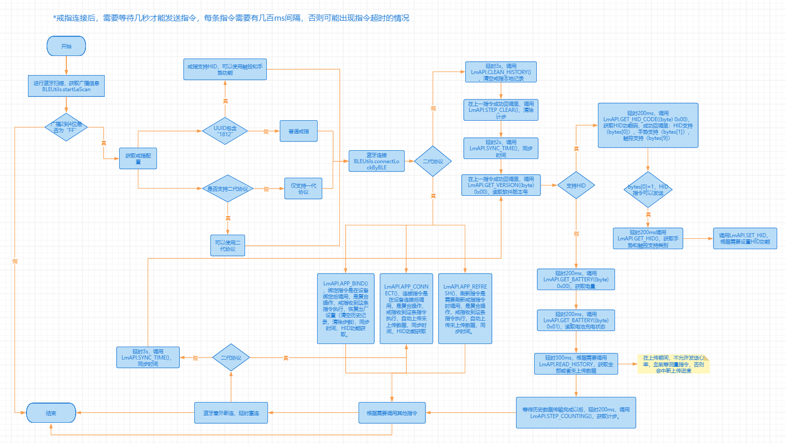
### 3.使用场景
戒指是否支持一二代协议，需要从广播中获取。支持二代协议的戒指，一定支持一代协议。如何判断协议版本请参考《广播解析》小章节。
#### 1.绑定流程图
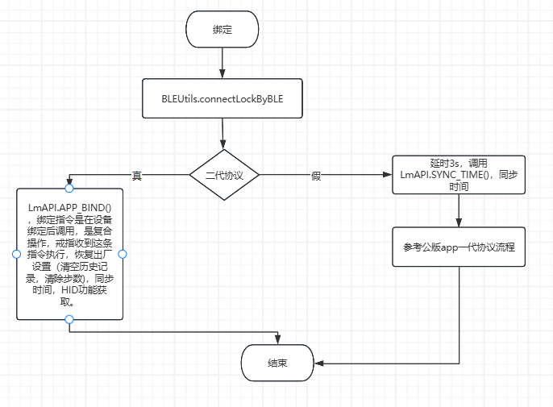
绑定即APP首次连接戒指时进行的操作。需要区分两种情况：
第一种是戒指仅支持一代协议，需要依次调用清除历史数据，同步时间，获取软硬件版本号，清空当前步数，获取支持的HID功能，每个接口在上一个完成后等待一定时间调用。比较耗时复杂，目前不再推荐使用。
第二种是戒指支持二代协议，连接成功后直接调用LmAPI.APP_BIND()，戒指收到这条指令执行后，自动执行恢复出厂设置（清空历史记录，清除步数），同步时间，HID功能获取。
#### 2.解绑流程图
图片为空。
解绑是指APP解除和戒指的绑定。需要区分两种情况：
第一种是戒指仅支持一代协议，解绑时需要判断戒指是否和手机进行配对，如果配对需要解除配对后，断开蓝牙。
第二种是戒指支持二代协议，解绑时需要判断戒指是否和手机进行配对，如果配对需要解除配对后，发送解绑指令后蓝牙断开。此处的用意是戒指将进入低功耗模式。
#### 3.连接流程图
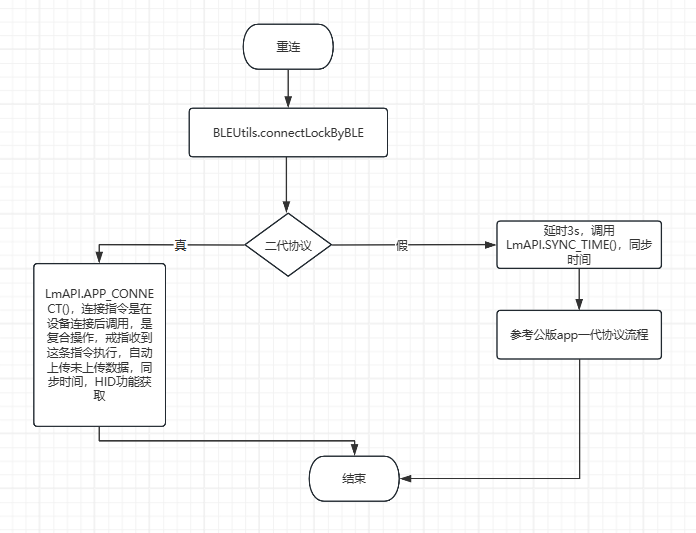
连接是指APP和戒指绑定之后，重新打开APP进行的操作。需要区分两种情况：
第一种是戒指仅支持一代协议，需要依次调用同步时间，获取软硬件版本号，获取当前步数，获取HID功能配置，获取未上传的历史记录的接口。比较耗时复杂，目前不再推荐使用。
第二种是戒指支持二代协议，连接成功后直接调用LmAPI.APP_CONNECT()。实现组合操作：同步时间，获取软硬件版本号，获取当前步数，获取HID功能配置，获取未上传的历史记录。
#### 4.重连流程图

在手机和戒指连接的过程中，可能由于电磁干扰或者距离远因素，连接是有几率断开的，此时需要实时监听断连回调，及时进行复连操作，操作流程参考连接流程。
#### 5.刷新流程图
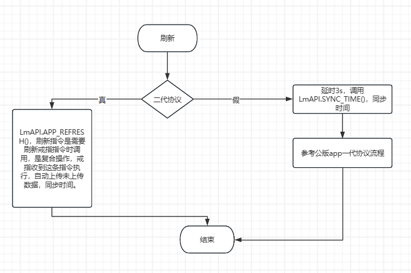   
刷新是指APP和戒指连接中，下拉APP进行刷新数据的操作。需要区分两种情况：
第一种是戒指仅支持一代协议，需要依次调用同步时间，获取当前步数，获取未上传的历史记录的接口。比较耗时复杂，目前不再推荐使用。
第二种是戒指支持二代协议，直接调用LmAPI.APP_REFRESH()。实现组合操作：同步时间，获取当前步数，获取未上传的历史记录。
## 三、移植步骤
### 1.库文件添加
1.获取到ChipletRing APP SDK的aar文件，放在libs目录下。
2.配置所需权限，牵扯到动态权限处 ，需要做相关处理，在Manifest.xml中加入以下代码:
```xml
<uses-permission android:name="android.permission.BLUETOOTH_ADVERTISE" />
<uses-permission android:name="android.permission.BLUETOOTH_CONNECT" />
<uses-permission android:name="android.permission.BLUETOOTH_SCAN" />
<uses-permission android:name="android.permission.ACCESS_COARSE_LOCATION" />
<uses-permission android:name="android.permission.ACCESS_FINE_LOCATION" />
```
2.目前只提供离线sdk，所以需要用户手动添加一些依赖，后期会做优化，版本号可以使用自己工程里的
```java
    implementation 'androidx.appcompat:appcompat:1.3.1'
    implementation 'org.greenrobot:greendao:3.3.0'
    implementation 'androidx.localbroadcastmanager:localbroadcastmanager:1.1.0'
    implementation 'org.ligboy.retrofit2:converter-fastjson-android:2.1.0'
    implementation 'com.squareup.retrofit2:adapter-rxjava:2.3.0'
    implementation 'org.jetbrains:annotations:15.0'
    implementation  'com.google.code.gson:gson:2.11.0'
    implementation 'com.zhy:okhttputils:2.6.2'
```
### 2.初始化库
1.在Application的onCreate方法中进行初始化
```java
LmAPI.init(this);
LmAPI.setDebug(true);
//如使用简化版本，需要初始化LmAPILite
LmAPILite.init(this);
LmAPILite.setDebug(true);
```
2.在BaseActivity类中启用监听，该监听用于监听蓝牙连接状态和戒指的应答
**注：若重复调用监听LmAPI.addWLSCmdListener(this, this)会出现重复现象**
```java
LmAPI.addWLSCmdListener(this, this);
// 监视蓝牙设备与APP连接的状态
IntentFilter intentFilter = new IntentFilter();
intentFilter.addAction(BluetoothAdapter.ACTION_STATE_CHANGED);
intentFilter.addAction(BluetoothDevice.ACTION_ACL_DISCONNECTED);
intentFilter.addAction(BluetoothDevice.ACTION_ACL_CONNECTED);
registerReceiver(broadcastReceiver,intentFilter);
//使用蓝牙之前，先申请去权限
if (Build.VERSION.SDK_INT >= Build.VERSION_CODES.S) {
    if (!checkPermissions(new String[]{Manifest.permission.ACCESS_COARSE_LOCATION, Manifest.permission.ACCESS_FINE_LOCATION, Manifest.permission.BLUETOOTH_SCAN, Manifest.permission.BLUETOOTH_CONNECT, Manifest.permission.BLUETOOTH_ADVERTISE})) {
        new XPopup.Builder(this).asConfirm(getRsString(R.string.hint), getString(R.string.localtion_auth),
                new OnConfirmListener() {
                    @Override
                    public void onConfirm() {
                        requestPermission(new String[]{Manifest.permission.ACCESS_COARSE_LOCATION, Manifest.permission.ACCESS_FINE_LOCATION, Manifest.permission.BLUETOOTH_SCAN, Manifest.permission.BLUETOOTH_CONNECT, Manifest.permission.BLUETOOTH_ADVERTISE}, 100);
                    }
                }).show();
        return;
    }
} else {
    if (!checkPermissions(new String[]{Manifest.permission.ACCESS_COARSE_LOCATION, Manifest.permission.ACCESS_FINE_LOCATION})) {
        new XPopup.Builder(this).asConfirm(getRsString(R.string.hint), getString(R.string.localtion_auth),
                new OnConfirmListener() {
                    @Override
                    public void onConfirm() {
                        requestPermission(new String[]{Manifest.permission.ACCESS_COARSE_LOCATION, Manifest.permission.ACCESS_FINE_LOCATION}, 100);
                    }
                }).show();
        return;
    }
}
```
### 3、库的使用
#### 3.1 蓝牙操作
此类是使用蓝牙搜索、连接、 断开的公共类 ，统一由IResponseListener接口反馈。 
##### 3.1.1 搜索设备
接口功能：开启蓝牙发现，发现周围的蓝牙设备并获取其广播的数据，解析广播数据判断是否符合智能戒指的广播格式，如果符合则从广播数据中获取配置信息。
接口声明：
```java
BLEUtils.startLeScan(Context context, BluetoothAdapter.LeScanCallback leScanCallback);
```
参数说明：context：上下文     leScanCallback：蓝牙搜索的回调  
返回值
```jave
（void onLeScan(BluetoothDevice device, int rssi, byte[] bytes)）
```
该接口的返回值说明如下：
```java
private BluetoothAdapter.LeScanCallback leScanCallback = new BluetoothAdapter.LeScanCallback() {
    @Override
    public void onLeScan(BluetoothDevice device, int rssi, byte[] bytes) {
        //处理搜索到的设备
    }
};
```
注意事项：在开发者调试时候，发现不到设备的情况下，可用公版APP进行绑定对比测试，一般情况下，戒指正常的话，手机靠近戒指，RSSI的值大于-60。
##### 3.1.2 停止搜索
接口功能：蓝牙连接以后，可以关闭蓝牙搜索功能。  
接口声明：
```java
BLEUtils.stopLeScan(Context context, BluetoothAdapter.LeScanCallback leScanCallback);
```
参数说明：context：上下文    leScanCallback：蓝牙搜索的回调  
返回值：无

##### 3.1.3 连接设备

接口功能：发起连接蓝牙设备。
接口声明：
```java
BLEUtils.connectLockByBLE(Context context, BluetoothDevice bluetoothDevice);
```
参数说明：context：上下文  
bluetoothDevice ：蓝牙设备  
返回值：
```java
@Override
public void lmBleConnecting(int code) {
    //正在连接
}
@Override
public void lmBleConnectionSucceeded(int code) {
    //连接成功
}
@Override
public void lmBleConnectionFailed(int code) {
    //连接失败
}
```
为了保证断连后重连，需要在以上回调里，设置一些属性
```java
@Override
public void lmBleConnecting(int code) {
    //正在连接
  BLEUtils.setConnecting(true);//连接中，防止重复连接
}
@Override
public void lmBleConnectionSucceeded(int code) {
    //连接成功
   BLEUtils.setConnecting(false);
}
@Override
public void lmBleConnectionFailed(int code) {
    //连接失败
  BLEUtils.setGetToken(false);//连接失败
  BLEUtils.setConnecting(false);
}
```
BLEUtils.setConnecting//蓝牙是否在连接中，防止重复连接
BLEUtils.setGetToken//是否已连接到蓝牙，这个按自己项目需求调用，公版app是在连接过后，指令走完，才算连接成功

蓝牙连接状态(仅供状态参考，不需要自己监听)：
```java
BroadcastReceiver mBLEStateChangeBroadcast = new BroadcastReceiver() {
            @Override
            public void onReceive(Context context, Intent intent) {
                if (intent != null) {
                    int state = intent.getIntExtra(BLEService.BROADCAST_CONNECT_STATE_VALUE, 0);
                    switch (state) {
                        case BLEService.CONNECT_STATE_GATT_CONNECTING:
                            //链接状态--GATT通道--连接中
                        case BLEService.CONNECT_STATE_GATT_CONNECTED:
                            // 链接状态--GATT通道--已连接
                        case BLEService.CONNECT_STATE_SERVICE_CONNECTING:
                            //链接状态--设备服务--连接中
                        case BLEService.CONNECT_STATE_SERVICE_CONNECTED:
                            // 链接状态--设备服务--已连接
                        case BLEService.CONNECT_STATE_WRITE_CONNECTING:
                            //链接状态--写入Character--连接中
                        case BLEService.CONNECT_STATE_RESPOND_CONNECTING:
                            //链接状态--响应Character--连接中
                            ibleResponse.lmBleConnecting(state);
                            break;
                        case BLEService.CONNECT_STATE_SUCCESS:
                            // 链接状态--BLE所有连接--连接成功--等待输入指令
                            ibleResponse.lmBleConnectionSucceeded(state);
                            break;
                        case BLEService.CONNECT_STATE_SERVICE_DISCONNECTED:
                            //链接状态--设备服务--连接失败
                            ibleResponse.lmBleConnectionFailed(state);
                        case BLEService.CONNECT_STATE_WRITE_DISCONNECTED:
                            //链接状态--写入Character--连接失败
                        case BLEService.CONNECT_STATE_RESPOND_DISCONNECTED:
                            //链接状态--响应Character--连接失败
                        case BLEService.CONNECT_STATE_DISCONNECTED:
                            //链接状态--断开
                            ibleResponse.lmBleConnectionFailed(state);
                            break;
                        default:
                            break;
                    }
                }

            }
        };
```
```java
 /**
     * 链接状态--GATT通道--连接中
     */
    public static final int CONNECT_STATE_GATT_CONNECTING = 1;
    /**
     * 链接状态--GATT通道--已连接
     */
    public static final int CONNECT_STATE_GATT_CONNECTED = 2;

    /**
     * 链接状态--设备服务--连接中
     */
    public static final int CONNECT_STATE_SERVICE_CONNECTING = 3;
    /**
     * 链接状态--设备服务--已连接
     */
    public static final int CONNECT_STATE_SERVICE_CONNECTED = 4;
    /**
     * 链接状态--写入Character--连接中
     */
    public static final int CONNECT_STATE_WRITE_CONNECTING = 5;
    /**
     * 链接状态--响应Character--连接中
     */
    public static final int CONNECT_STATE_RESPOND_CONNECTING = 6;
    /**
     * 链接状态--BLE所有连接--连接成功--等待输入指令
     */
    public static final int CONNECT_STATE_SUCCESS = 7;
    /**
     * 链接状态--设备服务--连接失败
     */
    public static final int CONNECT_STATE_SERVICE_DISCONNECTED = 8;
    /**
     * 链接状态--写入Character--连接失败
     */
    public static final int CONNECT_STATE_WRITE_DISCONNECTED = 9;
    /**
     * 链接状态--响应Character--连接失败
     */
    public static final int CONNECT_STATE_RESPOND_DISCONNECTED = 10;
    /**
     * 链接状态--断开
     */
    public static final int CONNECT_STATE_DISCONNECTED = 11;
```
##### 3.1.4 断开蓝牙
接口功能：断开设备。  
接口声明：

```java
BLEUtils.disconnectBLE(Context context);
```
参数说明：context：上下文  
返回值：无
##### 3.1.5 蓝牙重连
接口功能：在戒指连接断开时，重连设备，重连比连接速度要快
接口声明：
```java
        BluetoothDevice remote  = BluetoothAdapter.getDefaultAdapter().getRemoteDevice(mac);
                if(remote != null){
                    BLEUtils.connectLockByBLE(this,remote);
                }
```
参数说明：mac：戒指mac地址   
返回值：无  
公版app重连逻辑，如果蓝牙断开，延时重连，可以参考
```java
    private List<BluetoothDevice> dataEntityList = new ArrayList<>();

 @Override
    public void lmBleConnectionFailed(int i) {
        BLEUtils.setGetToken(false);
        postView("\n连接失败 ");

            Log.e("ConnectDevice", " 蓝牙 connectionFailed");

            handler.removeMessages(101);
            handler.sendEmptyMessageDelayed(101, 3000);

        }

  Handler handler = new Handler(new Handler.Callback() {
        @Override
        public boolean handleMessage(@NonNull Message msg) {

            if (msg.what == 101) {

                    String mac = UtilSharedPreference.getStringValue(TestActivity.this, "address");
                    if (!TextUtils.isEmpty(mac) && !BLEUtils.isGetToken()) {
                        Log.e("TAG", "Handler  延迟重连  resetConnect 1111 ");
                        BLEUtils.setConnecting(false);
                        connect(mac);
                    }

            }
            return false;
        }
    });


 /**
     * 断联以后，重连
     * @param mac
     */
    private void connect(String mac) {
        dataEntityList.clear();
        Logger.show(TAG, "connect=" + mac, 6);
        this.mac = mac;
        //合并
        checkPermission();
    }

    public void checkPermission() {

        String[] permission;
        if (Build.VERSION.SDK_INT >= Build.VERSION_CODES.S) {
            permission = new String[]{Permission.ACCESS_FINE_LOCATION, Permission.BLUETOOTH_CONNECT, Permission.BLUETOOTH_SCAN};
        } else {
            permission = new String[]{Permission.READ_MEDIA_IMAGES, Permission.READ_MEDIA_VIDEO, Permission.READ_MEDIA_AUDIO, Permission.WRITE_EXTERNAL_STORAGE, Permission.ACCESS_FINE_LOCATION};
        }
        XXPermissions.with(this).permission(permission)
                .request(new OnPermissionCallback() {
                    @Override
                    public void onGranted(@NonNull List<String> permissions, boolean allGranted) {
                        if (!allGranted) {
                            ToastUtils.show(getResources().getString(R.string.tips_get_permission_err));
                            return;
                        }

                        Logger.show("ConnectDevice", "mac :" + mac);
                        BluetoothDevice remote = BluetoothAdapter.getDefaultAdapter().getRemoteDevice(mac);
                        if (BLEService.isGetToken()) {
                            Logger.show("ConnectDevice", " 蓝牙已连接");

                        } else if (remote != null && (mac).equalsIgnoreCase(remote.getAddress())) {
                            Set<BluetoothDevice> bondedDevices = BluetoothAdapter.getDefaultAdapter().getBondedDevices();
                            Logger.show("ConnectDevice", " 蓝牙 RemoteDevice 连接   ");

                            //如果系统蓝牙已经有绑定的戒指，直接连接
                            if (bondedDevices.contains(remote)) {

                                BLEUtils.stopLeScan(TestActivity.this, leScanCallback);
                                BLEUtils.connectLockByBLE(TestActivity.this, remote);
                            } else {//如果没有，就进入扫描

                                Logger.show("ConnectDevice", " 蓝牙 startLeScan 连接   ");
                                BLEUtils.stopLeScan(TestActivity.this, leScanCallback);
                                BLEUtils.startLeScan(TestActivity.this, leScanCallback);
                            }
                            App.getInstance().setDeviceBean(new BleDeviceInfo(remote, -50));
                        } else {
                            Logger.show("ConnectDevice", " 蓝牙1 startLeScan 连接   ");
                            BLEUtils.stopLeScan(TestActivity.this, leScanCallback);
                            BLEUtils.startLeScan(TestActivity.this, leScanCallback);
                        }
                    }
                });
    }

    @SuppressLint("MissingPermission")
    private BluetoothAdapter.LeScanCallback leScanCallback = new BluetoothAdapter.LeScanCallback() {
        @Override
        public void onLeScan(BluetoothDevice device, int rssi, byte[] bytes) {
            if (device == null || StringUtils.isEmpty(device.getName())) {
                return;
            }
            if ((mac).equalsIgnoreCase(device.getAddress()) && !BLEService.isGetToken()) {
                if (dataEntityList.contains(device)) {
                    return;
                }
                Logger.show("ConnectDevice", "(mac).equalsIgnoreCase(device.getAddress())");
                try {

                    //是否符合条件，符合条件，会返回戒指设备信息
                    BleDeviceInfo bleDeviceInfo = LogicalApi.getBleDeviceInfoWhenBleScan(device, rssi, bytes);
                    if (bleDeviceInfo == null) {
                        Log.i("bleDeviceInfo","null");
                        return;
                    }


                    App.getInstance().setDeviceBean(bleDeviceInfo);
                    dataEntityList.add(device);
                    BLEUtils.stopLeScan(TestActivity.this, leScanCallback);
                    BLEUtils.connectLockByBLE(TestActivity.this, device);
                } catch (Exception e) {
                    e.printStackTrace();
                }
            }
        }
    };

```
##### 3.1.6 前台服务
目前蓝牙连接服务是后台的，存在息屏状态下，或者app进入后台，蓝牙断连的问题，好处就是功耗低。如果需要将服务做成前台服务，可以在Application的onCreate()里设置
```java
       BLEUtils.contentTitle = "自己想要展示在app前台服务里的内容"
```
这个需要自己在合适的时机，比如app退到后台时，5分钟后，调用

```java
BLEUtils.disconnectBLE(Context context);
```
断开连接，否则蓝牙一直连接，功耗很大，电量消耗很快
##### 3.1.6 解除绑定
 注意 换绑戒指时，建议将之前戒指解除绑定，调用指令，清理掉历史数据，否则有可能出现A戴过的戒指，B去戴，造成B的数据里有A的数据，或者一个人戴多个戒指睡眠，最后睡眠数据重叠的情况
```java
 //断开连接
  BLEUtils.disconnectBLE(getSupportActivity());
//解除系统蓝牙绑定，防止下次搜索不到戒指
  BLEUtils.removeBond(BLEService.getmBluetoothDevice());
```
#### 3.2 通讯协议
此类是使用戒指功能的公共类，戒指的功能通过该类直接调用即可,数据反馈除了特殊说明外 统一由IResponseListener接口反馈。(1.0.35版本后新增简化版本，入参和返回都做了封装，不再使用byte类型，通过LmAPILite调用，并且将指令返回接口按照功能分成多个小接口，职责更清晰，回调更少，之前监听LmAPI的地方换成LmAPILite即可)
调用此类的接口 ，需保证与戒指处于连接状态  
##### 3.2.0 广播解析
sdk封装根据蓝牙扫描广播，获取是否符合条件的戒指，并返回该戒指的设备信息的方法LogicalApi.getBleDeviceInfoWhenBleScan，设备信息包括是否HID戒指(hidDevice:1是0非，兼容老版本戒指)，是否支持二代协议(communicationProtocolVersion:1不支持2支持)，是否支持绑定(bindingIndicatorBit,0不支持绑定、配对(仅软连接) 1绑定和配对 2仅支持配对)，充电指示位(chargingIndicator,1代表未充电 2代表充电中)
```java
BLEUtils.startLeScan(this, leScanCallback);
 private BluetoothAdapter.LeScanCallback leScanCallback = new BluetoothAdapter.LeScanCallback() {
        @Override
        public void onLeScan(BluetoothDevice device, int rssi, byte[] bytes) {
            if (device == null || TextUtils.isEmpty(device.getName())) {
                return;
            }
            //是否符合条件，符合条件，会返回戒指设备信息
            BleDeviceInfo bleDeviceInfo = LogicalApi.getBleDeviceInfoWhenBleScan(device, rssi, bytes);
           
        }
    };
```
如果是HID戒指，需要设置BLEUtils.isHIDDevice为false，可以走强连接模式连接蓝牙，保证稳定性
##重要 HID的戒指连接，需要将AndroidManifest.xml里的activity添加一个属性，因为会修改手机配置，如果不加，会导致重启或者连接多次的问题：
```java
 android:configChanges="fontScale|keyboard|keyboardHidden|locale|orientation|screenLayout|uiMode|screenSize|navigation"
```
##### 3.2.1 同步时间
接口功能：调用此接口会获取手机当前时间同步给戒指。  
接口声明：
```java
LmAPI.SYNC_TIME();
//同步时间可以设置时区， 东区为正，西区为负，比如东八区0x08，西八区为0xF8
LmAPI.SYNC_TIME_ZONE();
```
注意事项：同步时间和读取时间共用一个返回值。 
参数说明：无  
返回值
```java
（void syncTime(byte datum,byte[] time)）
```
| 参数名称 | 类型   | 示例值 | 说明                        |
| -------- | ------ | ------ | --------------------------- |
| datum    | byte   | 0或1   | 0代表同步成功 1代表读取时间 |
| time     | byte[] | null   | 同步时间不会返回byte[]      |

简化版本
```java
public static void SYNC_TIME(ISyncTimeListenerLite listenerLite)

public interface ISyncTimeListenerLite {

    void syncTime(boolean updateTime,long timeStamp);
}
```

##### 3.2.2 读取时间
接口功能：调用此接口会获取戒指当前时间。一般情况下用不到。
接口声明：  
注意事项：同步时间和读取时间共用一个返回值。
参数说明：无
```java
LmAPI.READ_TIME();
```
返回值
```java
（void syncTime(byte datum,byte[] time)）
```
| 参数名称 | 类型   | 示例值                                              | 说明                                                   |
| -------- | ------ | --------------------------------------------------- | ------------------------------------------------------ |
| datum    | byte   | 0或1                                                | 0代表同步成功 1代表读取时间                            |
| time     | byte[] | [48, -23, -1, 83, -111, 1, 0, 0, 8] = 1723691166000 | 读取时间成功，需转化为时间戳(小端模式，最后一位为时区) |

简化版本
```java
 public static void READ_TIME(ISyncTimeListenerLite listenerLite) 

public interface ISyncTimeListenerLite {

    void syncTime(boolean updateTime,long timeStamp);
}
```

##### 3.2.3 版本信息
接口功能：版本信息 ，获取戒指的版本信息。  
接口声明：
```java
LmAPI.GET_VERSION((byte) 0x00);  //0x00获取软件版本，0x01获取硬件版本
```
参数说明：type：0x00获取软件版本 ，0x01获取硬件版本  
返回值
```java
（void VERSION(byte type, String version)）
```
| 参数名称 | 类型   | 示例值  | 说明                            |
| -------- | ------ | ------- | ------------------------------- |
| type     | byte   | 0或1    | 0代表软件版本号 1代表硬件版本号 |
| version  | String | 1.0.0.1 | 版本号                          |

简化版本
```java
public static void GET_VERSION(boolean softVersion,IVersionListenerLite listenerLite)

public interface IVersionListenerLite {
    void versionResult( String softwareVersion,String hardwareVersion);
}

```

##### 3.2.4 电池电量
接口功能：获取电池电量、 电池状态。  
接口声明：
```java
LmAPI.GET_BATTERY((byte) 0x00);  //0x00获取电量，0x01获取充电状态
```
参数说明：type：0x00获取电量 ，0x01获取充电状态  
返回值
```java
（void battery(byte status, byte datum)）
```
| 参数名称 | 类型 | 示例值 | 说明                        |
| -------- | ---- | ------ | --------------------------- |
| status   | byte | 0或1   | 0代表电池电量 1代表充电状态 |
| datum    | byte | 0-100  | 电量                        |
| datum    | byte | 1 | 0未充电 1充电中 2充满        |

简化版本
```java
//type 电池类型，0读取电量(充电中和充电完成，电量无效) 1充电状态，电量无效
static void GET_BATTERY(int type, IBatteryListenerLite listenerLite)

public interface IBatteryListenerLite {
  /**
     * 电量
     * @param type 获取电量还是获取充电状态 0是电量，1是充电状态
     * @param chargingStatus 充电状态描述
     * @param electricity 电量百分比
     */
    void battery(int type,String chargingStatus, int electricity);
}
```

##### 3.2.5 读取步数
接口功能：获取当天累计步数。  
接口声明：
```java
LmAPI.STEP_COUNTING（）
```
参数说明：无  
返回值
```java
（void stepCount(byte[] bytes)）
```
| 参数名称 | 类型   | 示例值 | 说明                                  |
| -------- | ------ | ------ | ------------------------------------- |
| bytes    | byte[] | 3303   | 步数819(小端模式，由0333转10进制得到) |

简化版本
```java
public static void STEP_COUNTING(IStepListenerLite listenerLite)

public interface IStepListenerLite {
    /**
     * 计步
     *
     * @param steps 步数
     */
    void stepCount(int steps);

    /**
     * 清除步数
     * @param
     */
    void clearStepCount();
}
```
##### 3.2.6 清除步数
接口功能：清除步数。  
接口声明：
```java
LmAPI.CLEAR_COUNTING（）
```
参数说明：无  
返回值：  
```java
（void clearStepCount(byte data)）
```
| 参数名称 | 类型   | 示例值 | 说明                                  |
| -------- | ------ | ------ | ------------------------------------- |
| byte    | data | 1   | 返回1代表清除步数成功 |

简化版本
```java
 public static void CLEAR_COUNTING(IStepListenerLite listenerLite)
 public interface IStepListenerLite {
    /**
     * 计步
     *
     * @param steps 步数
     */
    void stepCount(int steps);

    /**
     * 清除步数
     * @param
     */
    void clearStepCount();
}
```
##### 3.2.7 恢复出厂设置
接口功能：恢复出厂设置  
接口声明：
```java
LmAPI.RESET（）
```
参数说明：无  
返回值：无 ，有回调reset方法即认为成功
简化版本
```java
 public static void RESET(ISystemControlListenerLite listenerLite)

public interface ISystemControlListenerLite {
    /**
     * 恢复出厂设置
     */
    void reset();

    /**
     * 设置采集周期
     */
    void setCollection(boolean success);

    /**
     * 获取采集周期
     */
    void getCollection(int data);

    /**
     * 获取序列号
     * @param serial
     */
    void getSerialNum(String serial);

    /**
     * 设置序列号

     */
    void setSerialNum(boolean success);

    /**
     * 设置蓝牙名称
     */
    void setBlueToolName(boolean success);

    /**
     * 读取蓝牙名称
     * @param len 蓝牙名称长度
     * @param name 蓝牙名称
     */
    void readBlueToolName(int len,String name);
}
```
##### 3.2.8 采集周期设置
接口功能：采集周期设置  
接口声明：
```java
LmAPI.SET_COLLECTION（collection）//采集周期，单位秒
```
参数说明：colection：采集间隔，单位秒  
返回值：
```java
(void setCollection(byte result))
```

| 参数名称 | 类型   | 示例值   | 说明                        |
| -------- | ------ | -------- | --------------------------- |
| result   | byte   | 0，1     | 设置采集周期失败 1代表0代表设置采集周期成功 |

简化版本
```java
  public static void SET_COLLECTION(int parseInt,ISystemControlListenerLite listenerLite)
  public interface ISystemControlListenerLite {
    /**
     * 恢复出厂设置
     */
    void reset();

    /**
     * 设置采集周期
     */
    void setCollection(boolean success);

    /**
     * 获取采集周期
     */
    void getCollection(int data);

    /**
     * 获取序列号
     * @param serial
     */
    void getSerialNum(String serial);

    /**
     * 设置序列号

     */
    void setSerialNum(boolean success);

    /**
     * 设置蓝牙名称
     */
    void setBlueToolName(boolean success);

    /**
     * 读取蓝牙名称
     * @param len 蓝牙名称长度
     * @param name 蓝牙名称
     */
    void readBlueToolName(int len,String name);
}
```

##### 3.2.9 采集周期读取
接口功能：采集周期读取  
接口声明：

```java
LmAPI.GET_COLLECTION（）//采集周期，单位秒
```
参数说明：无  
返回值：
```java
(void getCollection(byte[] bytes))
```
| 参数名称 | 类型   | 示例值   | 说明                            |
| -------- | ------ | -------- | ------------------------------- |
| bytes    | byte[] | b0040000 | 采集时间间隔 ，单位秒 如：1200s |

简化版本
```java
   public static void GET_COLLECTION(ISystemControlListenerLite listenerLite)
   public interface ISystemControlListenerLite {
    /**
     * 恢复出厂设置
     */
    void reset();

    /**
     * 设置采集周期
     */
    void setCollection(boolean success);

    /**
     * 获取采集周期
     */
    void getCollection(int data);

    /**
     * 获取序列号
     * @param serial
     */
    void getSerialNum(String serial);

    /**
     * 设置序列号

     */
    void setSerialNum(boolean success);

    /**
     * 设置蓝牙名称
     */
    void setBlueToolName(boolean success);

    /**
     * 读取蓝牙名称
     * @param len 蓝牙名称长度
     * @param name 蓝牙名称
     */
    void readBlueToolName(int len,String name);
}
```

**注：无特殊标记的情况下，本SDK中返回的值皆为小端模式，demo中提供bytes转int的方法**
##### 3.2.10 测量心率
接口功能：测量心率。  
接口声明：
```java
LmAPI.GET_HEART_ROTA（byte waveForm, byte acqTime,IHeartListener iHeartListener）
```
参数说明：  
waveForm：是否配置波形 0不上传 1上传  
acqTime：采集时间 （byte）30s是正常时间,0为一直采集  
iHeartListener:  此接口是测量数据的监听  
返回值：

```java
 LmAPI.GET_HEART_ROTA((byte) 0x01, (byte)0x30, new IHeartListener() {
     @Override
     public void progress(int progress) {
         setMessage("正在测量心率..." + String.format("%02d%%", progress));
     }
     @Override
     public void resultData(int heart, int heartRota, int yaLi, int temp) {
                 //心率，心率变异性，压力，温度
     }
     @Override
     public void waveformData(byte seq, byte number, String waveData) {
                  //心率返回波形图数据分析：waveData
           }
     @Override
     public void rriData(byte seq, byte number, String data) {
         //心率测量中的RR间期值
     }
     @Override
     public void error(int value) {
         switch (value) {
             case 0:
                 ToastUtils.show("未佩戴");
                 break;
             case 2:
                 ToastUtils.show("充电中不允许采集");
                 break;
             case 4:
                 ToastUtils.show("繁忙，不执行");
                 break;
             default:
                 break;
         }
     }
     @Override
     public void success() {
     }
 });
```
简化版本
```java
   public static void GET_HEART_ROTA(int waveForm,int acqTime,IHeartListenerLite listenerLite)

   public interface IHeartListenerLite {
      void progress(int progress);
      void resultData(int heart,int heartRota,int yaLi,int temp);
      void waveformData(int serialNumber,int numberOfData,String waveData);
      void rriData(byte seq,byte number,String data);
      void error(int code,String message);
      void success();
      void stopHeart();
 }

主动测量以后，如果立刻从戒指读取未上传数据，有可能读取不到最新结果，因为戒指保存会有延迟，用户可以延时几秒获取，或者把测量数据保存到本地数据库，本地数据库已做去重操作，不用担心后续未上传数据上传以后，有重复数据的情况
以下是样例：
```java
  HistoryDataBean entity = new HistoryDataBean();
                entity.setMac(BLEUtils.mac);
                entity.setTime(System.currentTimeMillis() / 1000);
                entity.setHeartRate(heart);
                entity.setHeartRateVariability(heartRota);
                entity.setStressIndex(yaLi);
                entity.setTemperature(temp);
                entity.setSleepType(0);
                DataApi.instance.insertBatch(entity);

```

```
##### 3.2.11 测量血氧
接口功能：测量血氧。  
接口声明：
```java
LmAPI.GET_HEART_Q2（byte waveForm,IQ2Listener iQ2Listener）
```
参数说明：  
waveForm：是否配置波形 0不上传 1上传  
IQ2Listener: 此接口是测量数据的监听  
返回值：
```java
LmAPI.GET_HEART_Q2(new IQ2Listener() {
    @Override
    public void progress(int progress) {
        setMessage("正在测量血氧..." + String.format("%02d%%", progress));
    }
    @Override
    public void resultData(int heart, int q2, int temp) {
        //心率，血氧，温度
    }

    @Override
    public void waveformData (byte seq, byte number, String waveData) {
        //血氧返回波形图数据分析：waveData
    }
    @Override
    public void error(int value) {
        switch (value) {
            case 0:
                ToastUtils.show("未佩戴");
                break;
            case 2:
                ToastUtils.show("充电中不允许采集");
                break;
            case 4:
                ToastUtils.show("繁忙，不执行");
                break;
            default:
                break;
        }
    }
    @Override
    public void success() {
    }
});
```
简化版本
```java
   public static void GET_HEART_Q2(byte waveForm,IBloodOxygenListenerLite listenerLite)

   public interface IBloodOxygenListenerLite {
       void progress(int progress);
       void resultData(int heartRate,int bloodOxygen,int temperature);
       //seq 序号，number数量，波形图
       void waveformData(int serialNumber,int numberOfData,String waveformData);
       void error(int code,String message);
       void success();
       void stopQ2();
   }
```
##### 3.2.12 测量温度
###### (1) 使用血氧接口测温度
接口功能： 测量温度。  
接口声明：
```java
LmAPI.GET_HEART_Q2（IQ2Listener iQ2Listener）
```
注意事项：调用此接口 ，需保证与戒指处于连接状态  
参数说明：IQ2Listener: 此接口是测量数据的监听  
返回值：同上。测量血氧时同时会返回温度
**注：温度也有单独的接口，在逐步适配所有戒指，如果单独接口不可用，再使用LmAPI.GET_HEART_Q2接口**

简化版本
```java
   public static void GET_HEART_Q2(byte waveForm,IBloodOxygenListenerLite listenerLite)

   public interface IBloodOxygenListenerLite {
       void progress(int progress);
       void resultData(int heartRate,int bloodOxygen,int temperature);
       //seq 序号，number数量，波形图
       void waveformData(int serialNumber,int numberOfData,String waveformData);
       void error(int code,String message);
       void success();
       void stopQ2();
   }
```

###### (2) 使用温度单独接口
接口功能： 测量温度。  
接口声明：
```java
 LmAPI.READ_TEMP （ITempListener iTempListener）
```
参数说明：ITempListener: 此接口是测量温度的监听  
返回值：
| 参数名称 | 类型   | 示范值                | 说明       |
| -------- | ------ | ------------------ | ---------- |
| resultData   | int   | 3612      | 温度的结果，代表36.12℃    |
| testing   | int   | 100，200           | 测量中 |
| error | int | 2，3，4，5 | 2：未佩戴<br>3：繁忙<br>4：充电中<br>5：温度值无效 |

简化版本
```java
   public static void READ_TEMP(ITempListenerLite listenerLite)

   public interface ITempListenerLite {
  
      void resultData(int temp);
      void testing(int num);
  
      void error(int code);
  }
```
##### 3.2.13 历史记录管理
接口功能：读取历史记录。  
接口声明：
```java
LmAPI.READ_HISTORY(byte type, long timeMillis,IHistoryListener iHistoryListener)
```
参数说明：type: 1,获取全部历史记录；0，获取未上传的历史记录。读取过为上传历史记录，下次读取的时候，就会从上次读取时间以后算起，如果想要将之前的数据也拿到，可以在 progress自己记录，本地数据库也保存了数据，也可以通过DataApi.instance.queryHistoryData查询到。
timeMillis：秒级时间戳，0是默认所有未上传数据，传值以后，会上报该时间以后的数据，即使timeMillis在上次上传数据的时间之前
返回值：
```java
LmAPI.READ_HISTORY(type, new IHistoryListener() {
    @Override
    public void error(int code) {
        handler.removeMessages(0x99);
        dismissProgressDialog();
        switch (code) {
            case 0:
                ToastUtils.show("正在测量中,请稍后重试");
                break;
            case 1:
                ToastUtils.show("正在上传历史记录,请稍后重试");
                break;
            case 2:
                ToastUtils.show("正在删除历史记录,请稍后重试");
                break;
            default:
                break;
        }
    }
    @Override
    public void success() {
        //同步完成
    }
    @Override
    public void progress(double progress, com.lm.sdk.mode.HistoryDataBean dataBean) {
           //处理历史数据
    }
});
```

简化版本
```java
   public static void READ_HISTORY(int type, long timeMillis,IHistoryListenerLite listenerLite)

   public interface IHistoryListenerLite {
    void error(int code);
    void success();
    void progress(double progress, HistoryDataBean historyDataBean);
    void clearHistory();
}
```

##### 3.2.14 清空历史数据
接口功能：清空历史数据。  
接口声明：
```java
LmAPI.CLEAN_HISTORY（）
```
参数说明：无  
返回值：无

简化版本
```java
   public static void CLEAN_HISTORY()
```
##### 3.2.15 血压测试
接口功能：血压测试。  
接口声明：
```java
LmAPI.GET_BPwaveData()
```
注意事项：戒指固件必须支持，否则无法使用。
参数说明：无  
返回值
```java
(byte seq,byte number,String waveDate)
```
| 参数名称 | 类型   | 示范值                                                                            | 说明       |
| -------- | ------ | --------------------------------------------------------------------------------- | ---------- |
| seq      | byte   | 0                                                                                 | 序号0      |
| number   | byte   | 10                                                                                | 有10个数据 |
| waveDate | String | green/绿光:14289393 ir/红外:10108995 cur_green/绿光电流:4704 cur_ir/红外电流:4704 | 光和电流值 |

简化版本
```java
   public static void GET_BPwaveData(int time,int ledGreen1,int ledGreen2,int ledIr,IBloodPressureTestListenerLite listenerLite)
   public interface IBloodPressureTestListenerLite {
       /**
        * 血压测试算法
        *
        * @param seq 顺序
        * @param dataNumber 数据个数
        * @param waveDate data
        */
       void BPwaveformData(int seq,int dataNumber,String waveDate);
   }

```

##### 3.2.16 实时PPG血压测量
接口功能：实时测量血压值和500hz的原始波形  
接口声明：
```java
LmAPI.GET_REAL_TIME_BP（byte time,byte isWave,byte isProgress,IRealTimePPGBpListener iRealTimePPGBpListener）
```
注意事项：戒指固件必须支持，否则无法使用。
参数说明：  
time：采集时间,byte类型，默认30s  
isWave:是否上传波形。0：不上传，1：上传  
isProgress：是否上传进度。0：不上传，1：上传
```java
LmAPI.GET_REAL_TIME_BP((byte) 0x30, (byte) 1, (byte) 1, new IRealTimePPGBpListener() {
                    @Override
                    public void progress(int progress) {
                        //进度
                    }

                    @Override
                    public void bpResult(byte type) {
                        //[0]:舒张压
                        //[1]:收缩压
                    }

                    @Override
                    public void resultData(String bpData) {
                        //bpData包含红外值
                    }
             });
```
简化版本
```java
   public static void GET_REAL_TIME_BP(int time,int isWave,int isProgress,IRealTimePPGBpListenerLite iRealTimePPGBpListener)
   public interface IRealTimePPGBpListenerLite {
    void progress(int progress);
    /**
     * 血压响应
     * @param bloodPressureType 0：舒张压，1：收缩压
     */
    void bpResult(int bloodPressureType);
    /**
     * 血压算法响应
     * @param bpData 响应数据
     */
    void resultData(String bpData);

    void  stopRealTimeBP();
}
```

##### 3.2.17 实时PPG血压停止采集
接口功能：停止采集  
接口声明：
```java
LmAPI.STOP_REAL_TIME_BP()
```
注意事项：戒指固件必须支持，否则无法使用。
参数说明：无  
回调：
```java
 @Override
    public void stopRealTimeBP(byte isSend) {
        if(isSend == (byte)0x01){
            Logger.show("TAG","停止采集已发送");
        }
  }
```
简化版本
```java
  public static void STOP_REAL_TIME_BP(IRealTimePPGBpListenerLite iRealTimePPGBpListener)
  public interface IRealTimePPGBpListenerLite {
    void progress(int progress);
    /**
     * 血压响应
     * @param bloodPressureType 0：舒张压，1：收缩压
     */
    void bpResult(int bloodPressureType);
    /**
     * 血压算法响应
     * @param bpData 响应数据
     */
    void resultData(String bpData);

    void  stopRealTimeBP();
}
```

##### 3.2.18 设置蓝牙名称
接口功能：设置蓝牙名称  
接口声明：
```java
LmAPI.Set_BlueTooth_Name(String name)
```
参数说明：  
Name:蓝牙名称，不超过12个字节，可以为中文、英文、数字，即4个汉字或者12个英文  
注：设置蓝牙名称后，广播不会立即改变，需要等待一段时间  
回调：
```java
@Override
    public void setBlueToolName(byte data) {
        if(data == (byte)0x00){
            Logger.show("TAG","设置失败");
        }else if(data == (byte)0x01){
            Logger.show("TAG","设置成功");
        }
  }
```
简化版本
```java
 public static void Set_BlueTooth_Name(String name,ISystemControlListenerLite listenerLite)
 public interface ISystemControlListenerLite {
    /**
     * 恢复出厂设置
     */
    void reset();

    /**
     * 设置采集周期
     */
    void setCollection(boolean success);

    /**
     * 获取采集周期
     */
    void getCollection(int data);

    /**
     * 获取序列号
     * @param serial
     */
    void getSerialNum(String serial);

    /**
     * 设置序列号

     */
    void setSerialNum(boolean success);

    /**
     * 设置蓝牙名称
     */
    void setBlueToolName(boolean success);

    /**
     * 读取蓝牙名称
     * @param len 蓝牙名称长度
     * @param name 蓝牙名称
     */
    void readBlueToolName(int len,String name);
}
```

##### 3.2.19 获取蓝牙名称
接口功能：设置蓝牙名称  
接口声明：
```java
LmAPI.Get_BlueTooth_Name()
```
参数说明：无  
回调：

```java
@Override
    public void readBlueToolName(byte len, String name) {
        Logger.show("TAG","蓝牙名称长度：" + len + " 蓝牙名称：" + name);
  }
```
简化版本
```java
 public static void Get_BlueTooth_Name(ISystemControlListenerLite listenerLite)
 public interface ISystemControlListenerLite {
    /**
     * 恢复出厂设置
     */
    void reset();

    /**
     * 设置采集周期
     */
    void setCollection(boolean success);

    /**
     * 获取采集周期
     */
    void getCollection(int data);

    /**
     * 获取序列号
     * @param serial
     */
    void getSerialNum(String serial);

    /**
     * 设置序列号

     */
    void setSerialNum(boolean success);

    /**
     * 设置蓝牙名称
     */
    void setBlueToolName(boolean success);

    /**
     * 读取蓝牙名称
     * @param len 蓝牙名称长度
     * @param name 蓝牙名称
     */
    void readBlueToolName(int len,String name);
}
```

##### 3.2.20 心率测量停止
接口功能：停止正在测量的心率  
接口声明：
```java
LmAPI.STOP_HEART()
```
注意事项：戒指固件必须支持，否则无法使用。调用此接口 ，需保证与戒指处于连接状态  
参数说明：无  
回调：
```java
@Override
    public void stopHeart(byte data) {
        Logger.show("TAG","stop success");
  }
```
简化版本
```java
 public static void STOP_HEART(IHeartListenerLite iHeartListener)
 public interface IHeartListenerLite {
      void progress(int progress);
      void resultData(int heart,int heartRota,int yaLi,int temp);
      void waveformData(int serialNumber,int numberOfData,String waveData);
      void rriData(byte seq,byte number,String data);
      void error(int code,String message);
      void success();
      void stopHeart();
 }
```

##### 3.2.21 血氧测量停止

接口功能：停止正在测量的血氧  
接口声明：

```java
LmAPI.STOP_Q2()
```
注意事项：戒指固件必须支持，否则无法使用。调用此接口 ，需保证与戒指处于连接状态  
参数说明：无  
回调：
```java
@Override
    public void stopQ2(byte data) {
        Logger.show("TAG","stop success");
  }
```
简化版本
```java
 public static void STOP_Q2(IBloodOxygenListenerLite iq2Listener)
  public interface IBloodOxygenListenerLite {
       void progress(int progress);
       void resultData(int heartRate,int bloodOxygen,int temperature);
       //seq 序号，number数量，波形图
       void waveformData(int serialNumber,int numberOfData,String waveformData);
       void error(int code,String message);
       void success();
       void stopQ2();
   }
```
##### 3.2.22 一键获取状态
接口功能：一键获取系统支持的功能，简化版的接口集合，会返回电量、固件版本、采集周期等(已被二代协议替代，参考3.2.28 二代协议)  
接口声明：此接口仅硬件版本号为2.3.2的戒指支持。
```java
LmAPI.SYSTEM_CONTROL()
```
参数说明：无  
回调：
```java
@Override
    public void SystemControl(SystemControlBean systemControlBean) {
        postView("\nSystemControl："+systemControlBean.toString());
  }
```
##### 3.2.23 语音录制
 (sdk1.0.44支持adpcm转换)
接口功能：获取主动推送音频信息(需要开启HID中的触摸语音，按住戒指上的磨砂区域，进行录音，戒指主动推送音频信息) 
接口声明：
```java
LmAPI.GET_CONTROL_AUDIO_ADPCM();
```
回调：
```java
 public void GET_CONTROL_AUDIO_ADPCM(byte pcmType) {
        if(pcmType==0x0){//是PCM
                new Handler().postDelayed(new Runnable() {
                    @Override
                    public void run() {
                        //设置推送adpcm
                        LmAPI.CONTROL_AUDIO_ADPCM_AUDIO((byte) 0x1);
                    }
                },200);
        }
    }
```
接口功能：设置主动推送音频信息，如果是pcm格式，建议设置成adpcm，防止丢包
接口声明：
```java
//设置推送adpcm
LmAPI.CONTROL_AUDIO_ADPCM_AUDIO((byte) 0x1);
```

接口功能：控制音频传输
接口声明：
```java
LmAPI.CONTROL_AUDIO_ADPCM(byte data)
```
参数说明：(byte) 0x1 开启，(byte) 0x0 关闭 
回调：
```java
@Override
   public void CONTROL_AUDIO(byte[] bytes) {
       //通过以上设置，默认都是adpcm格式
 byte[] adToPcm = new AdPcmTool().adpcmToPcmFromJNI(bytes);
  }
```
**注：返回的数据是byte数组，adpcm格式转为pcm格式，保存到文件中**

简化版本
```java


 //获取主动推送音频信息，通过getControlAudioAdpcmResult(boolean adpcm)返回，如果不是adpcm，建议调用PUSH_AUDIO_INFORMATION设置成adpcm
 public static void GET_CONTROL_AUDIO_ADPCM(IAudioListenerLite listenerLite) 


 //设置主动推送音频信息，是否开启adpcm格式，通过pushAudioInformationResult返回，success为true说明设置adpcm格式正确
 public static void PUSH_AUDIO_INFORMATION(boolean isAdPcm,IAudioListenerLite listenerLite)


 //控制adpcm格式音频传输，是否开启adpcm格式，建议设置成adpcm，即isOpen设置成true，否则有丢包的风险， 数据信息通过controlAudioResult
 //方法返回，结果已经转码为pcm，不需要像复杂版本，调用new AdPcmTool().adpcmToPcmFromJNI(bytes)
 public static void CONTROL_ADPCM_TRANSFER(boolean isOpen,IAudioListenerLite listenerLite)


 public interface IAudioListenerLite {
     /**
      *控制音频传输
      * @param bytes
      */
     void controlAudioResult(byte[] bytes);
 
     /**
      *获取主动推送音频信息
      */
     void getControlAudioAdpcmResult(boolean adpcm);
 
     /**
      *获取主动推送音频信息
      */
     void pushAudioInformationResult(boolean success);
 }
```

录音戒指灯光含义：
* 录音的时候绿灯亮
* 充电的时候呼吸灯
* 蓝牙连接亮蓝灯2s
* 断开连接闪烁3次蓝灯
##### 3.2.24 获取HID功能码
接口功能：获取连接戒指支持的HID功能，只有支持的功能，才能通过(3.2.25 设置HID)进行设置
接口声明：
```java
LmAPI.GET_HID_CODE((byte)0x00);
```
参数说明：
| 参数名称 | 类型   | 示例值   | 说明                            |
| -------- | ------ | -------- | ------------------------------- |
| byte    | byte | 0 |系统类型：<br> 0：安卓<br> 1：IOS<br> 2：windows |
回调：
```java
    @Override
    public void GET_HID_CODE(byte[] bytes) {
        Logger.show("getHidCode", "支持与否：" + bytes[0] + " 触摸功能：" + bytes[1] + " 空中手势：" + bytes[9] + "\n");

        Logger.show("byteToBitString", byteToBitString(bytes[1]));
        char[] touchModes = byteToBitString(bytes[1]).toCharArray();
        char[] gestureModes = byteToBitString(bytes[9]).toCharArray();

        if (bytes[0] == 0) {
            postView("\n不支持HID功能");
        } else {
            postView("\n支持HID功能");
        }
        if ("00000000".equals(byteToBitString(bytes[1]))) {//不支持触摸功能
            postView("\n不支持触摸功能");
        } else {
            postView("\n支持触摸功能");
        }

        if (touchModes[touchModes.length - 1] == '1') {//拍照
            postView("\n支持触摸拍照功能");
        } else {
            postView("\n不支持触摸拍照功能");
        }

        if (touchModes[touchModes.length - 2] == '1') {//短视频
            postView("\n支持触摸短视频功能");
        } else {
            postView("\n不支持触摸短视频功能");
        }

        if (touchModes[touchModes.length - 3] == '1') {//音乐
            postView("\n支持触摸音乐功能");
        } else {
            postView("\n不支持触摸音乐功能");
        }

        if (touchModes[touchModes.length - 5] == '1') {//音频
            postView("\n支持触摸音频功能");
        } else {
            postView("\n不支持触摸音频功能");
        }

        if ("00000000".equals(byteToBitString(bytes[9]))) {//不支持空中手势
            postView("\n不支持空中手势功能");
        } else {
            postView("\n支持空中手势功能");
        }

        if (gestureModes[gestureModes.length - 1] == '1') {//拍照
            postView("\n支持手势拍照功能");
        } else {
            postView("\n不支持手势拍照功能");
        }

        if (gestureModes[gestureModes.length - 2] == '1') {//短视频
            postView("\n支持手势短视频功能");
        } else {
            postView("\n不支持手势短视频功能");
        }

        if (gestureModes[gestureModes.length - 3] == '1') {//音乐
            postView("\n支持手势音乐功能");
        } else {
            postView("\n不支持手势音乐功能");
        }

        if (gestureModes[gestureModes.length - 5] == '1') {//打响指（拍照）
            postView("\n支持打响指（拍照）功能");
        } else {
            postView("\n不支持打响指（拍照）功能");
        }
    }
```

简化版本
```java
  public static void GET_HID_CODE(int system,IHIDListenerLite listenerLite){
  public interface IHIDListenerLite {
 
     /**
      * 设置HID模式  0代表失败，1代表成功
      */
     void setHIDResut(boolean success);
 
     /**
      * 获取HID模式
      * @param touchMode  手势
      * @param gestureMode   触控
      * @param system  系统
      */
     void getHIDInfo(int touchMode,int gestureMode,int system);
 
     /**
      * 获取HID功能码
      * @param HIDSupport HID功能支持
      * @param touchSupport 触摸功能
      *  @param gestureSupport 手势功能
      */
     void getHidCode(boolean HIDSupport, TouchSupport touchSupport, GestureSupport gestureSupport);
 
 }
```

##### 3.2.25 设置HID
接口功能：设置戒指的HID模式   
接口声明：
```java
                byte[] hidBytes = new byte[3];
                hidBytes[0] = 0x04;             //触摸功能，样例是上传实时音频(其他的参考参数说明，设置0x01,0x02,(byte) 0xFF等)
                hidBytes[1] = (byte) 0xFF;      //手势功能，样例是关闭(其他的参考参数说明，设置0x01,0x02,(byte) 0xFF等)
                hidBytes[2] = 0x00;             //系统类型 0：安卓  1：IOS  2：鸿蒙
                LmAPI.SET_HID(hidBytes,TestActivity2.this);
```
参数说明：
| 参数名称 | 类型   | 示例值   | 说明                            |
| -------- | ------ | -------- | ------------------------------- |
| byte[0]    | byte | 4 |触摸hid 模式0：刷视频模式<br>1：拍照模式<br>2：音乐模式<br>3: ppt模式<br>4：上传实时音频<br>0xFF:关闭 |
| byte[1]    | byte | (byte)0xFF |手势hid 模式0：刷视频模式<br>1：拍照模式<br>2：音乐模式<br>3：ppt模式<br>4：打响指(拍照)模式<br>0xFF:关闭|
| byte[2]    | byte | 0 |系统类型：<br> 0：安卓<br> 1：IOS<br> 2：鸿蒙 |

返回值：
```java
   @Override
    public void SET_HID(byte result) {
        if(result == (byte)0x00){
            postView("\n设置HID失败");
        }else if(result == (byte)0x01){
            postView("\n设置HID成功");
        }
    }
```
| 参数名称 | 类型   | 示例值   | 说明                            |
| -------- | ------ | -------- | ------------------------------- |
| result    | byte | 0,1 |0代表设置失败 1代表设置成功 |

简化版本
```java
  /**
     * 设置HID
     * @param touchMode  触摸hid 模式
     * 0：刷视频模式
     * 1：拍照模式
     * 2：音乐模式
     * 3: ppt模式
     * 4：上传实时音频
     * 255:关闭
     * @param gestureMode 手势hid 模式
     * 0：刷视频模式
     * 1：拍照模式
     * 2：音乐模式
     * 3：ppt模式
     * 4：打响指(拍照)模式
     * 255:关闭
     * @param context
     * @param listenerLite
     */
    public static void SET_HID(int touchMode,int gestureMode, Context context,IHIDListenerLite listenerLite)
```

##### 3.2.26 获取HID
接口功能：获取当前戒指的HID模式，触摸各功能和手势各功能的开关状态  
接口声明：
```java
LmAPI.GET_HID();
```
参数说明：无   
返回值：
```java
    @Override
    public void GET_HID(byte touch, byte gesture, byte system) {
        postView("\n当前触摸hid模式：" + touch + "\n当前手势hid模式：" + gesture + "\n当前系统：" + system);
    }
```
| 参数名称 | 类型   | 示例值   | 说明                            |
| -------- | ------ | -------- | ------------------------------- |
| touch    | byte | 4 |触摸hid 模式0：刷视频模式<br>1：拍照模式<br>2：音乐模式<br>3：ppt模式<br>4：上传实时音频<br>0xFF:关闭|
| gesture    | byte | -1 |手势hid 模式0：刷视频模式<br>1：拍照模式<br>2：音乐模式<br>3：ppt模式<br>4：打响指(拍照)模式<br>0xFF:关闭 |
| system    | byte | 0|系统类型 0：安卓<br>1：IOS<br>2：WINDOWS |

**注：-1和0xFF含义一样，代表关闭**  

简化版本
```java
 public static void GET_HID(IHIDListenerLite listenerLite)
```

##### 3.2.27 获取RSSI
RSSI是信号强度的意思，一般用于ota升级前对戒指的信号检测，建议 > -70  
```java
    BLEService.readRomoteRssi();
    Log.i(TAG, "rssi = "+ BLEService.RSSI);
```
会有一点延时，在Activity里注册个回调获取
```java
BLEService.setCallback(new BluetoothConnectCallback() {
            @Override
            public void onConnectReceived(String data) {
             
            }

            @Override
            public void onGetRssi(int rssi) {
                App.getInstance().getDeviceBean().setRssi(rssi);
            }
        });
```
需要注意rssi变化略微延迟，数字越大，信号越强，如 -52 > -60
##### 3.2.28 二代协议
二代协议是一个协议，返回多个指令，大大加快了连接速度，二代协议只有支持的设备才能发送，判断设备是否支持参考(3.2.0 广播解析)：

绑定指令:（绑定指令是在设备绑定后调用，是复合操作，戒指收到这条指令执行，恢复出厂设置（清空历史记录，清除步数)，同步时间，HID功能获取。）
```java
    LmAPI.APP_BIND();
```
回调：
```java
 @Override
    public void appBind(SystemControlBean systemControlBean) {
        postView("\nappBind："+systemControlBean.toString());
    }
```
因为APP_CONNECT和appRefresh会自动上传未上传数据，需要在页面进行监听，否则会报错
```java
LmAPI.READ_HISTORY_AUTO(IHistoryListener iHistoryListener)
```
连接指令:（连接指令是在设备连接后调用，是复合操作，戒指收到这条指令执行，自动上传未上传数据，同步时间，HID功能获取）
```java
    LmAPI.APP_CONNECT();
```
回调：
```java
 @Override
    public void appConnect(SystemControlBean systemControlBean) {
        postView("\nappConnect："+systemControlBean.toString());
    }
```
刷新指令:（刷新指令是需要刷新戒指指令时调用，是复合操作，戒指收到这条指令执行，自动上传未上传数据，同步时间。）
```java
    LmAPI.APP_REFRESH();
```
回调：
```java
     @Override
    public void appRefresh(SystemControlBean systemControlBean) {
        postView("\nappRefresh："+systemControlBean.toString());
    }
```

实体类字段意义：
```java
public class SystemControlBean {
    private String firmwareVersion;//固件版本号
    private String hardwareVersion;//硬件版本号
    private byte battery;//电量
    private byte chargingStatus;//充电状态
    private String collectionInterval;//当前采集间隔
    private byte[] HID_CODE;//当前HID功能码
    private byte[] HID_MODE;//当前HID模式
    private byte heartRate;//心率曲线支持
    private byte blood;//血氧曲线支持
    private byte variability;//变异性曲线支持
    private byte pressure;//压力曲线支持
    private byte temperature;//温度曲线支持
    private byte womenHealth;//女性健康支持
    private byte vibration;//震动闹钟支持
    private byte electrocardiogram;//心电图功能支持
    private byte microphone;//麦克风支持
    private byte sport;//运动模式支持
    private int stepCounting;//当前计步
    private int keyTest;//自检标识
```
简化版本
```java
 public static void APP_BIND(IBindConnectRefreshListenerLite listenerLite)
 public static void APP_CONNECT(IBindConnectRefreshListenerLite listenerLite)
 public static void APP_REFRESH(IBindConnectRefreshListenerLite listenerLite)

 public interface IBindConnectRefreshListenerLite {
     void appBind(SystemControlBean systemControlBean);
     void appConnect(SystemControlBean systemControlBean);
     void appRefresh(SystemControlBean systemControlBean);
 }
```

##### 3.2.29 心电图
心电图功能只支持心电戒指，可以通过BLEUtils.isSupportElectrocardiogram()判断是否支持,可以通过
```java
LogicalApi.startECGActivity(TestActivity2.this);
```
查看心电图样例，可以直接使用，如需定制化，可以参考项目中的(SourceCode/心电图相关)

对应的指令是：
```java
 LmAPI.STAR_ELEC()//开启心电测量
 LmAPI.STOP_ELECTROCARDIOGRAM();//结束心电测量
```
简化版本
```java
 public static void STAR_ELEC(IECGListenerLite mIecgListener)
 public static void STOP_ELECTROCARDIOGRAM()

 public interface IECGListenerLite {
     void result(int HRValue,int[] ecgValues);
     void error(int code);
 }

```

#### 3.3 固件升级（OTA）
**注：目前不建议使用，可以参考四、升级服务里的OTA升级**
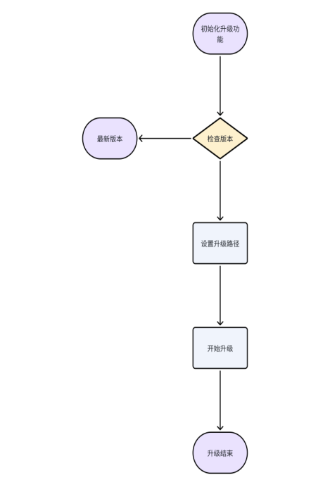
**注：这是phyOTA流程，其它芯片使用官方库**
[Nordic Android库链接](https://github.com/NordicSemiconductor/Android-DFU-Library)
[Nordic ios库链接](https://github.com/NordicSemiconductor/IOS-DFU-Library)
##### 3.3.1 检查版本
接口功能：检查固件版本是否是最新。  
接口声明：
```java
OtaApi.checkVersion(String version, VersionCallback versionCallback);
```
注意事项：调用此接口 ，需保证与戒指处于连接状态  
参数说明：version：当前戒指的版本号  
versionCallback：最新版本信息回调  
返回值：
```java
OtaApi.checkVersion(version, new VersionCallback() {
    @Override
    public void success(String newVersion) {
    //newVersion：云端最新版本号
        if (!StringUtils.isEmpty(newVersion)){
            //有新版本
        }else{
            //已是最新版本
        }
    }

    @Override
    public void error() {
        //获取最新版本失败
    }
});
```
##### 3.3.2 开始升级
接口功能：执行固件升级。  
接口声明：
```java
void startUpdate(BluetoothDevice bluetoothDevice, int rssi, LmOTACallback otaCallback)
```
注意事项：调用此接口 ，需保证与戒指处于连接状态,建议rssi <= -71(参考3.2.27 获取RSSI)并且电量>50  
参数说明：bluetoothDevice： 当前要升级的设备  
rssi：设备信号值  
otaCallback：升级回调  
返回值：
```java
OtaApi.startUpdate(App.getInstance().getDeviceBean().getDevice(), App.getInstance().getDeviceBean().getRssi(), new LmOTACallback() {
    @Override
    public void onDeviceStateChange(int i) {
        //设备状态回调
    }

    @Override
    public void onProgress(int i, int i1) {
        //升级进度
    }

    @Override
    public void onComplete() {
        //升级完成
    }
});
```
#### 3.4 数据库相关（DataApi）
##### 3.4.1 查询历史记录
接口功能：查询指定时间的历史数据  
接口声明：
```java
//查询历史数据
List<HistoryDataBean> queryHistoryData(long dayBeginTime,long dayEndTime,String mac) 
//查询历史数据按照时间进行正序
List<HistoryDataBean> queryHistoryDataOrderByTimeAsc(long dayBeginTime,long dayEndTime,String mac)
//查询历史数据按照步数进行倒叙
List<HistoryDataBean> queryHistoryDataOrderByStepCountDesc(long dayBeginTime,long dayEndTime,String mac)
```
**注意事项：计算睡眠时间的接口需要先调用查询历史数据**  
参数说明：dayBeginTime ：开始时间戳，单位：秒  
dayEndTime ：结束时间戳，单位：秒  
mac ：设备的MAC地址  
返回值：
```java
public class HistoryDataBean{
    @Id
    private Long id;
    private String mac;
     //总数据包数 4个字节
    private long totalNumber;
     // 当前第几包 4个字节
    private long indexNumber;
     // 当前记录时间 4个字节
    private long time;
     //今天累计步数 2个字节
    private int stepCount;
     // 心率 1个字节
    private int heartRate;
     // 血氧 1个字节
    private int bloodOxygen;
     //心率变异性 1个字节
    private int heartRateVariability;
     //精神压力指数 1个字节
    private int stressIndex;
     //温度 2个字节
    private int temperature;
    //运动激烈程度 1个字节
    private int exerciseIntensity;
    /**
     * 睡眠类型 1个字节
     * 0：无效
     * 1：清醒
     * 2：浅睡
     * 3：深睡
     * 4.眼动期
     */
    private int sleepType;
     // 保留 2个字节
    private int reserve;
     //RR间期 1个字节
    private int rrCount;
     //RR数组数据 1个字节
    private byte[] rrBytes;
 }
```
##### 3.4.2 清空历史数据
接口功能：清空全部历史数据。  
接口声明：
```java
void deleteHistoryData()；
```
注意事项：需开启相应权限  
参数说明：无  
返回值：无
#### 3.5 逻辑算法相关（LogicalApi）
##### 3.5.1 计算距离、卡路里
接口功能：根据步数计算距离、卡路里。  
接口声明：
```java
DistanceCaloriesBean calculateDistance(int stepCount,double height,double weight)；
```
注意事项：需开启相应权限  
参数说明：stepCount：步数  
height：身高 单位cm  
weight：体重 单位kg  
返回值：
```java
public class DistanceCaloriesBean {
    //距离，单位米
    private double distance;
    //卡路里，单位卡
    private double kcal;
}
```
##### 3.5.2 计算睡眠数据
**注：建议使用四、升级服务中的睡眠结果数据**
接口功能：计算指定时间睡眠数据。  
接口声明：
```java
SleepBean calculateSleep(String date, String mac, int type)；
```
**注意事项：计算睡眠时间的接口需要先调用查询历史数据，本地数据库仅供缓存，用户可以通过3.2.13 历史记录管理获取戒指历史数据**  

**常见问题：**  
问：如何获取历史数据？答：可以查询本地数据库获取历史数据，但是本地数据库不准，因为app删掉或者切换过戒指以后，数据库里数据会变动，可以通过（3.2.13 历史记录管理）获取戒指历史数据

问：如何保证睡眠数据正确？答：需要保证历史数据完整，睡眠算法默认计算从前一天18点到当天18点之间的数据，如果一个戒指，在A手机同步过未上传数据，在B手机同步时，会从A手机同步后的时间进行同步，这样B就会少掉A同步过的数据，数据链不完整，计算错误

问：什么时候获取所有历史数据，什么时候获取未上传历史数据？答：如果有自己服务器，可以将获取历史数据指令回调后的数据，同步到自己服务器，同步完成后，计算睡眠数据，从服务器拉取历史数据进行计算，这样就不怕切换戒指和删除app，只需要同步未上传数据即可。如果没有自己服务器，可以在首次安装app时，获取所有历史数据，后续都是获取未上传数据，如果睡眠计算出错，可以获取所有历史数据验证一下

问：计算睡眠数据需要什么流程？答：睡眠准确性需要保证数据准确性，所以需要先获取戒指历史数据（有服务器的，将未上传数据同步到服务器，，数据链应该是完整的，然后从服务器拉取数据），没有服务器的，可以先同步未上传历史数据，如果睡眠有问题，可能戒指在其他地方同步过，导致数据有部分中断，可以获取一下所有历史数据验证一下。
问：参数date应该传哪一天的值？答：算法计算的是所传日期的前一天18点到当天18点，所以如果想查询昨天的睡眠数据，传的应该是当天时间
参数说明：date：日期，格式为YYYY-MM-DD HH:mm:ss  
mac ：设备蓝牙MAC  
type：暂时无效  
返回值：
```java
public class SleepBean{
    //零星睡眠小时
    int hours = 0;
    //零星睡眠分钟
    int minutes = 0;
    //全部睡眠小时
    int allHours = 0;
    // 全部睡眠分钟
    int allMinutes =0;
    //睡眠小时
    int sleepHours = 0;
    //睡眠分钟
    int sleepMinutes =0;
    //深度睡眠时间
    long highTime = 0;
    //浅度睡眠时间
    long lowTime = 0;
    // 眼动时间
    long ydTime = 0;
    //清醒时间
    long qxTime = 0;
    //入睡时间戳
    long startTime = 0;
    //清醒时间戳
    long endTime = 0;
    //睡眠数据
    private List<HistoryDataBean> historyDataBeanList;
}
```
数据库中数据
```java
public class HistoryDataBean{
    @Id
    private Long id;
    private String mac;
     // 总数据包数 4个字节
    private long totalNumber;
     // 当前第几包 4个字节
    private long indexNumber;
     // 当前记录时间 4个字节
    private long time;
     // 今天累计步数 2个字节
    private int stepCount;
     // 心率 1个字节
    private int heartRate;
     // 血氧 1个字节
    private int bloodOxygen;
     // 心率变异性 1个字节
    private int heartRateVariability;
     // 精神压力指数 1个字节
    private int stressIndex;
     // 温度 2个字节
    private int temperature;
     // 运动激烈程度 1个字节
    private int exerciseIntensity;
    /**
     * 睡眠类型 1个字节
     * 0：无效
     * 1：清醒
     * 2：浅睡
     * 3：深睡
     * 4.眼动期
     */
    private int sleepType;
     // 保留 2个字节
    private int reserve;
     // RR间期 1个字节
    private int rrCount;
     // RR数组数据 1个字节
    private byte[] rrBytes;
 }
```
## 四、升级服务
### 1、服务介绍
为了进一步简化用户对接流程，提高算法质量，共享固件资源，将公版app所用的服务进行共享(1.0.34版本后新增)，仅需要3个步骤，就可以使用升级服务(服务的接口是http的，如果调用方使用的是https，需要同时兼容两种模式，如调用服务无响应，可能是因为CLEARTEXT communication to XX not permitted by network security policy 这样的错误)
### 1、申请key
合作方可以联系我们，提供贵公司的名称，我们分配调用服务的key
### 2、申请token
根据key，和使用sdk的用户的手机号或者邮箱，就可以申请token，token会自动保存在本地，不需要用户保存
```java
 LogicalApi.createToken("","", new ICreateToken() {
            @Override
            public void getTokenSuccess() {

            }

            @Override
            public void error(String msg) {

            }
        });
```
### 3、调用服务
根据token，调用服务，目前提供获取用户睡眠数据的服务，ota升级服务
### 4、支持的服务
##### 1、睡眠结果数据（仅为部分厂家提供支持，需要联系我司对接key）
可以根据开始时间和结束时间，获取当前用户的睡眠结果数据，系统根据历史数据，自动区分一代睡眠和二代睡眠，调用该服务的前提，是需要在获取戒指历史数据的时候，将历史数据上传，否则无法计算，这个接口会把之前调用这个接口，由于服务器原因，没能上传成功的数据上传上去，所以如果存在切换用户的需求，可以在切换之前，清除一下上传错误的数据，或者上传一下，否则有可能把之前登录人员的数据，同步到当前登录人数据中
```java
DataApi.instance.deleteHistoryErrorBatch();
```
```java
   //如需使用更精准的睡眠算法，获取戒指历史数据时，请调用该指令(LmAPI.READ_HISTORY不支持上传服务器操作)
   LmAPI.READ_HISTORY_UPDATE_TO_SERVER((byte) 0x01,  mac, new IHistoryListener() {
                    @Override
                    public void error(int code) {
                        if (code == 3) {
                            postView("\n出现了BIX的问题");
                        }
                        setMessage(TestActivity.this, "\n出现了BIX的问题");
                    }

                    @Override
                    public void success() {
                        postView("\n读取记录完成");

                    }

                    @Override
                    public void progress(double progress, HistoryDataBean historyDataBean) {
                        if (historyDataBean != null) {
                            postView("\n读取记录进度:" + progress + "%");
                            postView("\n记录内容:" + historyDataBean.toString());
                        }

                    }
                }, new IWebHistoryResult() {
                    @Override
                    public void updateHistoryFinish() {
                        postView("\n历史数据上传服务器完成");
                    }
                });
```
获取睡眠数据
```java
                postView("\n从云端计算睡眠");
                String dateTimeString = "2025-02-12 23:59:59";

                LogicalApi.getSleepDataFromService( dateTimeString, new IWebSleepResult() {
                    @Override
                    public void sleepDataSuccess(Sleep2thBean sleep2thBean) {
                        // 定义日期时间格式
                        SimpleDateFormat sdf = new SimpleDateFormat("yyyy-MM-dd HH:mm:ss");
                        // 将时间戳转换为 Date 对象
                        Date startDate = new Date(sleep2thBean.getStartTime()*1000);
                        // 将时间戳转换为 Date 对象
                        Date endDate = new Date(sleep2thBean.getEndTime()*1000);
                        postView("\n入睡时间:" + sdf.format(startDate)+"\n清醒时间:" +sdf.format(endDate)+"\n睡眠小时:" + sleep2thBean.getHours()+"\n睡眠分钟:" + sleep2thBean.getMinutes() );

                    }

                    @Override
                    public void error(String message) {

                    }

                });
```
##### 2、ota升级
该服务支持从云端拉取最新的固件，需保证与戒指处于连接状态,建议rssi > -70(参考3.2.27 获取RSSI)并且电量>50 ，目前提供三个接口，根据不同情况调用
OtaApi.otaUpdateWithCheckVersion 该接口包含了检查版本号version(调用 LmAPI.GET_VERSION((byte) 0x00)获取)，从云端拉取最新固件，自动升级功能，ota升级完成以后，要延时3s重连一下戒指

```java
OtaApi.otaUpdateWithCheckVersion(version, TestActivity.this, App.getInstance().getDeviceBean().getDevice(), App.getInstance().getDeviceBean().getRssi(), new LmOtaProgressListener() {
                    @Override
                    public void error(String message) {
                        postView("\nota升级出错："+message);
                    }

                    @Override
                    public void onProgress(int i) {
                      //  postView("\nota升级进度:"+i);
                        Logger.show("OTA","OTA升级"+i);
                    }

                    @Override
                    public void onComplete() {
                        postView("\nota升级结束");
                        OtaApi.destoryOta(TestActivity.this);
                    }

                    @Override
                    public void isLatestVersion() {
                        postView("\n已是最新版本");
                    }
                });
```
OtaApi.checkCurrentVersionNeedUpdate，检查当前硬件版本是否需要更新，用于在页面上需要显示更新信息的需求
```java
   OtaApi.checkCurrentVersionNeedUpdate(version, TestActivity.this, new ICheckOtaVersion() {
                    @Override
                    public void checkVersionResult(boolean needUpdate) {
                        
                    }
                });
```
OtaApi.otaUpdateWithVersion是在调用OtaApi.checkCurrentVersionNeedUpdate后，需要更新固件时调用，去掉了检查是否更新的步骤
```java
 OtaApi.otaUpdateWithVersion(version, App.getInstance().getDeviceBean().getDevice(), App.getInstance().getDeviceBean().getRssi(), new LmOtaProgressListener() {
                    @Override
                    public void error(String message) {
                        
                    }

                    @Override
                    public void onProgress(int i) {

                    }

                    @Override
                    public void onComplete() {

                    }

                    @Override
                    public void isLatestVersion() {

                    }
                });
```

## 五、其他
**注：使用戒指API前，应先查看戒指状态**
### 1、筛选相关
血氧戒指设备以XXXXXX的名字进行广播。XXX为任何字符，广播间隔为500ms。本例中XXX为BCL603。  
广播包的长度必须是31个字节，如果不到31个字节 ，则剩下的全用0填充 补全，这部分的数据是无效的
#### 1.1 广播数据单元
广播包中包含若干个广播数据单元，广播数据单元也称为 AD Structure。  
广播数据单元 = 长度值Length + AD type + AD Data  
长度值Length只占一个字节，并且位于广播数据单元的第一个字节。  
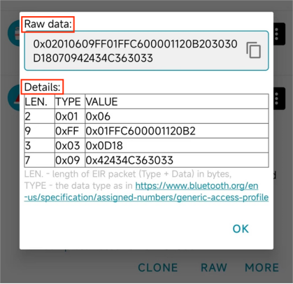
##### 1.1.1 Raw data:
0x代表这串字符串是十六进制的字符串。两位十六进制数代表一个字节。因为两个字符组成的十六进制字符串最大为FF，即255，而Java中byte类型的取值范围是-128到127，刚好可以表示一个255的大小。所以两个十六进制的字符串表示一个字节。  
 继续查看报文内容，开始读取第一个广播数据单元。读取第一个字节:0x02,转换为十进制就是2，即表示后面的2个字节是这个广播数据单元的数据内容。超过这2个字节的数据内容后，表示是一个新的广播数据单元。  
 而第二个广播数据单元，第一个字节的值是0x09,转换为十进制就是9，表示后面9个字节为第二个广播数据单元。  
而第三个广播数据单元，第一个字节的值是0x03,转换为十进制就是3，表示后面3个字节为第三个广播数据单元。  
以此类推。  
在广播数据单元的数据部分中，第一个字节代表数据类型（AD type），决定数据部分表示的是什么数据。（即广播数据单元第二个字节为AD type）
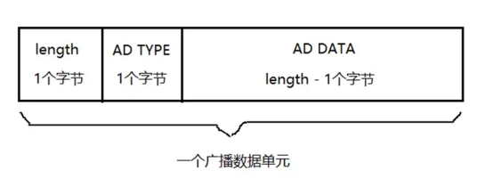
##### 1.1.2 Details:
(1)、Type = 0x01 表示设备LE物理连接。  
(2)、Type = 0xFF 表示厂商数据。前两个字节表示厂商ID,即厂商ID为0xFF01。后面的为厂商数据，具体由用户自行定义  
(3)、Type = 0x03 表示完整的16bit UUID。其值为0x0D18。  
(4)、Type = 0x09 表示设备的全名，例如：0x42434C363033转byte[]再转字符串即为“BCL603” 
#### 1.2 应用
**注：数据传输方式为小端模式**
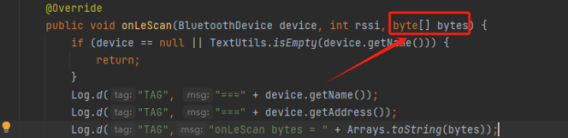
调用蓝牙扫描时找到返回的byte[],这里具体为[2, 1, 6, 9, -1, 1, -1, -58, 0, 0, 17, 32, -78, 3, 3, 13, 24, 7, 9, 66, 67, 76, 54, 48, 51, 0, 0, 0, 0, 0, 0, 0, 0, 0, 0, 0, 0, 0, 0, 0, 0, 0, 0, 0, 0, 0, 0, 0, 0, 0, 0, 0, 0, 0, 0, 0, 0, 0, 0, 0, 0, 0]  
注：byte数据需转换为16进制  
已知该数据的格式和含义，根据规则设置筛选条件为厂商ID == “FF01”即可  
或直接对接收到的数据验证“01FF”（``后续二代广播只需要识别广播中arr[1]为FF即可``）
##### 1.2.1 广播最新版本（二代协议）
检测方法：用manudata里面的固定位置检测``FF``，如 arr[1] = ``FF``   
二代广播和一代广播的不同在于厂商ID"FF01"（小端模式），第1个字节``FF``不变，第0个字节``01``不再固定，表示更多含义  
第0个字节的bit表示：``00000000``   
释意：  
``bit[0:1]``：充电指示位   
``bit[2:3]``：绑定指示位  
``bit[4:7]``：通讯协议版本号  
| 参数名称 | 类型   | 示例值   | 说明                            |
| -------- | ------ | -------- | ------------------------------- |
| 充电指示位    | bit | 1 |1代表未充电 2代表充电中|
| 绑定指示位    | bit | 2 |0不支持绑定、配对(仅软连接) 1绑定和配对 2仅支持配对 |
| 通讯协议版本号    | bit | 0|0:不支持一键获取状态指令的版本<br>1:支持一键获取状态指令的版本 |
 **注：软连接指仅app内连接；<br>绑定和配对指系统层面弹出是否配对选项并且系统蓝牙层面有"！"图标，可以点击；<br>仅配对指系统蓝牙层面没有"!"图标** 
### 2、可能会遇到的问题
资料中带有简单demo，可以先查看简单demo使用SDK的逻辑，再进行自己的开发
#### 2.1 版本相关
Gradle版本。可在gradle-wrapper.properties里修改  
```java
distributionBase=GRADLE_USER_HOME
distributionPath=wrapper/dists
distributionUrl=https\://services.gradle.org/distributions/gradle-8.0-all.zip
zipStoreBase=GRADLE_USER_HOME
zipStorePath=wrapper/dists
```
可在以下网址下载所需版本，将zip放在wrapper/dists对应的路径下（放在随机码文件夹下，记得清空原有内容），重新sync一下  
提供Gradle网站：[Gradle Distributions](https://services.gradle.org/distributions/)
#### 2.2 Gradle 4.0以上导致Xpopup无法使用问题
Xpopup是个第三方弹窗框架，换为普通弹窗可以解决问题
#### 2.3 不需要界面如何使用
ringSDK1.0.2已支持不需要界面，在service做扫描、连接等功能  
**注：后续更新没有专门针对这个开发，如有需要，可以专门更新**
#### 2.4 OTA类引用未找到
可能会出现以下情况：
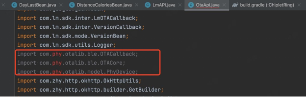
这是官方的其他依赖库，若找不到，可以打开Demo，原始jar包已放到SDK的OTA类文件夹下
### 3、硬件算法逻辑或固件相关
#### 3.1 戒指相关
问：戒指多久存一次数据  
答：可以配置为5，20，30分钟，默认20分钟  
问：OTA升级会清除数据吗  
答：不一定  
问：戒指里的数据可以存几天  
答：最大7天，7天后自动覆盖  
问：恢复出厂设置是只恢复戒指吗  
答：对，只针对戒指硬件进行恢复
#### 3.2 算法相关
问：为什么使用SDK的心率/血氧测量时总显示超时  
答：戒指充电时，无法进行心率血氧测量
#### 3.3 睡眠逻辑图
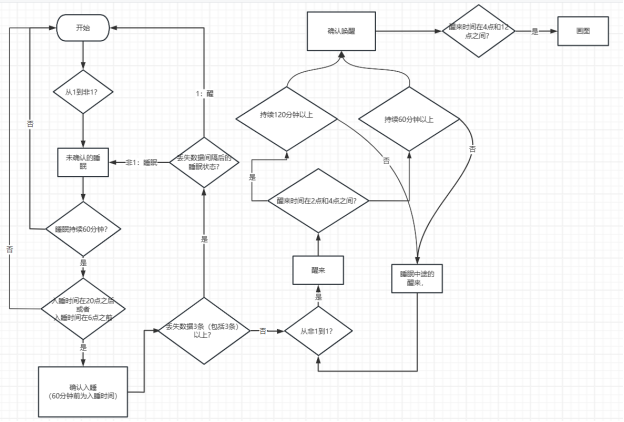
#### 3.4 午睡逻辑图
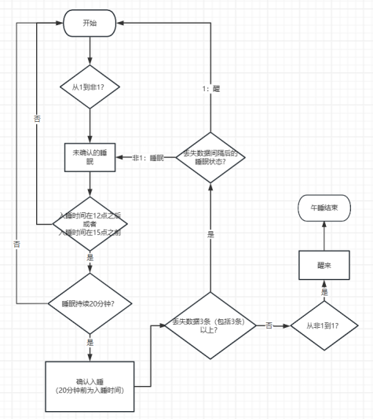
### 4、Q&A
Q：读历史记录过程中，是上报一条标记一条已同步，还是全部上传了整体标记？  
A：一条一条  
Q：采集周期设置有什么限制  
A: 采集周期单位为秒，正常值最小为60s，为0时代表关闭采集。
