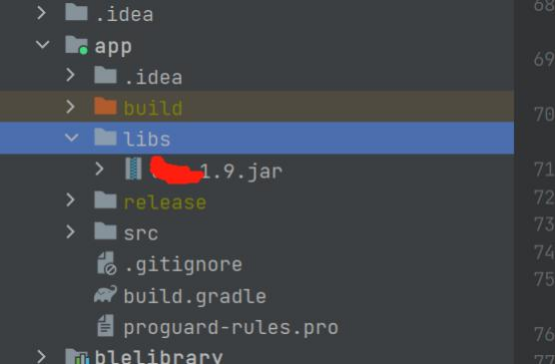

# 安卓SDK说明文档

*每次替换新的aar时首先要Sync Project with Gradle Files*

## 一、文档简介

### 文档目的

为方便Android端APP与戒指通讯进行二次开发 ，特对通讯协议进行封装 ，以达到简洁明了 ，让开发者不需要关注与戒指通讯层 ，专注业务逻辑交互层面开发。

### 适用范围

本SDK基于安卓原生开发 ，最终提供为jar包库。可用于Android环境下使用。  
**注：使用开发语言为JAVA**

### 功能介绍

<table>
<thead>
<tr>
<th align="left">功能模块</th>
<th align="left">说明</th>
<th align="left">相关文档</th>
</tr>
</thead>
<tbody><tr>
<th align="left" rowspan="3" nowrap="nowrap">蓝牙基础模块</th>
<td align="left">蓝牙的开关操作</td>
<td align="left"></td>
</tr>
<tr>
<td align="left">蓝牙的搜索链接操作</td>
<td align="left"></td>
</tr>
</tr>
<tr>
<td align="left">蓝牙的数据写入监听操作</td>
<td align="left"></td>
</tr>
<tr>
<th align="left" rowspan="14" nowrap="nowrap">通讯协议模块</th>
<td align="left">时间管理</td>
<td align="left"></td>
</tr>
<tr>
<td align="left">版本管理</td>
<td align="left"></td>
</tr>
<tr>
<td align="left">电量管理</td>
<td align="left"></td>
</tr>
<tr>
<td align="left">步数管理</td>
<td align="left"></td>
</tr>
<tr>
<td align="left">系统设置</td>
<td align="left"></td>
</tr>
<tr>
<td align="left">采集周期设置</td>
<td align="left"></td>
</tr>
<tr>
<td align="left">心率测量</td>
<td align="left"></td>
</tr>
<tr>
<td align="left">血氧测量</td>
<td align="left"></td>
</tr>
<tr>
<td align="left">心率变异性测量</td>
<td align="left"></td>
</tr>
<tr>
<td align="left">历史记录管理</td>
<td align="left"></td>
</tr>
<tr>
<td align="left">血压测量</td>
<td align="left"></td>
</tr>
<tr>
<td align="left">蓝牙名称设置</td>
<td align="left"></td>
</tr>
<tr>
<td align="left">语音录制</td>
<td align="left"></td>
</tr>
<tr>
<td align="left">HID功能</td>
<td align="left"></td>
</tr>
<tr>
</tbody></table>

## 二、快速入门概览

### 前置条件

* Android系统环境 ，系统版本>=5.0
* 必须支持蓝牙5.0
* 使用语言须可以调用jar包

### 使用流程

按以下流程使用 SDK：  
第—步：集成 SDK  
第二步：初始化 SDK  
第三步：使用 SDK  

### 流程图


## 三、集成ChipletRing APP SDK

### 1.集成ChipletRing APP SDK

#### 1.1 集成方式

##### 1.1.1 获取到ChipletRing APP SDK的jar包文件

##### 1.1.2 将jar包放在libs目录下

##### 1.1.3 右键设置为Add as Library(添加为类库)



##### 1.1.4 配置所需权限 ，如需存储以及其他权限可自行配置 ，牵扯到动态权限处 ，需要做相关处理  

在Manifest.xml中加入以下代码

```xml
<uses-permission android:name="android.permission.BLUETOOTH_ADVERTISE" />
<uses-permission android:name="android.permission.BLUETOOTH_CONNECT" />
<uses-permission android:name="android.permission.BLUETOOTH_SCAN" />
<uses-permission android:name="android.permission.ACCESS_COARSE_LOCATION" />
<uses-permission android:name="android.permission.ACCESS_FINE_LOCATION" />
```

### 2.初始化ChipletRing APP SDK

#### 2.1.1 在Application的onCreate方法中进行初始化

```java
LmAPI.init(this);
LmAPI.setDebug(true);
```

#### 2.1.2 在BaseActivity类中 ，启用监听 ，该监听用于监听蓝牙连接状态以及戒指基础指令反馈的数据

```java
LmAPI.addWLSCmdListener(this, this);
// 监视蓝牙设备与APP连接的状态
IntentFilter intentFilter = new IntentFilter();
intentFilter.addAction(BluetoothAdapter.ACTION_STATE_CHANGED);
intentFilter.addAction(BluetoothDevice.ACTION_ACL_DISCONNECTED);
intentFilter.addAction(BluetoothDevice.ACTION_ACL_CONNECTED);
registerReceiver(broadcastReceiver,intentFilter);

//使用蓝牙之前，先申请去权限
if (Build.VERSION.SDK_INT >= Build.VERSION_CODES.S) {
    if (!checkPermissions(new String[]{Manifest.permission.ACCESS_COARSE_LOCATION, Manifest.permission.ACCESS_FINE_LOCATION, Manifest.permission.BLUETOOTH_SCAN, Manifest.permission.BLUETOOTH_CONNECT, Manifest.permission.BLUETOOTH_ADVERTISE})) {
        new XPopup.Builder(this).asConfirm(getRsString(R.string.hint), getString(R.string.localtion_auth),
                new OnConfirmListener() {
                    @Override
                    public void onConfirm() {
                        requestPermission(new String[]{Manifest.permission.ACCESS_COARSE_LOCATION, Manifest.permission.ACCESS_FINE_LOCATION, Manifest.permission.BLUETOOTH_SCAN, Manifest.permission.BLUETOOTH_CONNECT, Manifest.permission.BLUETOOTH_ADVERTISE}, 100);
                    }
                }).show();
        return;
    }

} else {
    if (!checkPermissions(new String[]{Manifest.permission.ACCESS_COARSE_LOCATION, Manifest.permission.ACCESS_FINE_LOCATION})) {
        new XPopup.Builder(this).asConfirm(getRsString(R.string.hint), getString(R.string.localtion_auth),
                new OnConfirmListener() {
                    @Override
                    public void onConfirm() {
                        requestPermission(new String[]{Manifest.permission.ACCESS_COARSE_LOCATION, Manifest.permission.ACCESS_FINE_LOCATION}, 100);
                    }
                }).show();
        return;
    }
}
```

**注：若重复调用监听LmAPI.addWLSCmdListener(this, this)会出现重复现象**

### 3、使用ChipletRing APP SDK

#### 3.1 蓝牙操作（BLEUtils）

此类是使用蓝牙搜索、连接、 断开的公共类 ，统— 由IResponseListener接口反馈。或者单独的接口（会有说明）

##### 3.1.1 搜索设备

接口功能：开启蓝牙搜索功能 ，搜索周围的蓝牙设备。
接口声明：

```java
BLEUtils.startLeScan(Context context, BluetoothAdapter.LeScanCallback leScanCallback);
```

参数说明：context：上下文     leScanCallback：蓝牙搜索的回调  
返回值

```jave
（void onLeScan(BluetoothDevice device, intrssi, byte[] bytes)）
```

该接口的返回值说明如下：

```java
private BluetoothAdapter.LeScanCallback leScanCallback = new BluetoothAdapter.LeScanCallback() {

    @Override
    public void onLeScan(BluetoothDevice device, int rssi, byte[] bytes) {
        //处理搜索到的设备
    }
};
```

注意事项：1.保证蓝牙设备有电  
2.如要筛选蓝牙设备（厂商ID == 0xFF01），具体请参考四、其他，筛选相关

##### 3.1.2 停止搜索

接口功能：关闭蓝牙搜索功能。  
接口声明：

```java
BLEUtils.stopLeScan(Context context, BluetoothAdapter.LeScanCallback leScanCallback);
```

注意事项：调用此接口 ，需保证与戒指处于连接状态  
参数说明：context：上下文    leScanCallback：蓝牙搜索的回调  
返回值：无

##### 3.1.3 连接设备

接口功能：发起连接蓝牙设备。
接口声明：

```java
BLEUtils.connectLockByBLE(Context context, BluetoothDevice bluetoothDevice);
```

注意事项：1.调用此接口 ，需保证与戒指处于连接状态  
2.扫描连接时会自动判断是否为长连接，在已经长连接下去重连时，需手动输入bool值确认是否重连（demo里有示例）  
参数说明：context：上下文  
bluetoothDevice ：蓝牙设备  
返回值：

```java
@Override
public void lmBleConnecting(int code) {
    //正在连接
}

@Override
public void lmBleConnectionSucceeded(int code) {
    //连接成功
}

@Override
public void lmBleConnectionFailed(int code) {
    //连接失败
}
```

##### 3.1.4 断开蓝牙

接口功能：断开设备。  
接口声明：

```java
BLEUtils.disconnectBLE(Context context);
```

注意事项：调用此接口 ，需保证与戒指处于连接状态  
参数说明：context：上下文  
返回值：无

#### 3.2 指令功能（LmAPI）

此类是使用戒指功能的公共类 ，戒指的功能通过该类直接调用即可,数据反馈除了特殊说明外 统一 由IResponseListener接口反馈

##### 3.2.1 同步时间

接口功能：同步时间 ，调用此接口 ，会获取手机当前时间同步给戒指 ，保持时间同步。  
接口声明：

```java
LmAPI.SYNC_TIME();
```

注意事项：同步时间和读取时间共用一个返回值。调用此接口 ，需保证与戒指处于连接状态  
参数说明：无  
返回值

```java
（void syncTime(byte datum,byte[] time)）
```

| 参数名称 | 类型   | 示例值 | 说明                        |
| -------- | ------ | ------ | --------------------------- |
| datum    | byte   | 0或1   | 0代表同步成功 1代表读取时间 |
| time     | byte[] | null   | 同步时间不会返回byte[]      |

##### 3.2.2 读取时间

接口功能：读取时间 ，调用此接口 ，会获取戒指当前时间。  
接口声明：  
注意事项：同步时间和读取时间共用一个返回值。调用此接口 ，需保证与戒指处于连接状态  
参数说明：无

```java
LmAPI.READ_TIME();
```

返回值

```java
（void syncTime(byte datum,byte[] time)）
```

| 参数名称 | 类型   | 示例值                                              | 说明                                                   |
| -------- | ------ | --------------------------------------------------- | ------------------------------------------------------ |
| datum    | byte   | 0或1                                                | 0代表同步成功 1代表读取时间                            |
| time     | byte[] | [48, -23, -1, 83, -111, 1, 0, 0, 8] = 1723691166000 | 读取时间成功，需转化为时间戳(小端模式，最后一位为时区) |

##### 3.2.3 版本信息

接口功能：版本信息 ，获取戒指的版本信息。  
接口声明：

```java
LmAPI.GET_VERSION((byte) 0x00);  //0x00获取软件版本，0x01获取硬件版本
```

注意事项：调用此接口 ，需保证与戒指处于连接状态  
参数说明：type：0x00获取软件版本 ，0x01获取硬件版本  
返回值

```java
（void VERSION(byte type, String version)）
```

| 参数名称 | 类型   | 示例值  | 说明                            |
| -------- | ------ | ------- | ------------------------------- |
| type     | byte   | 0或1    | 0代表软件版本号 1代表硬件版本号 |
| version  | String | 1.0.0.1 | 版本号                          |

##### 3.2.4 电池电量

接口功能：获取电池电量、 电池状态。  
接口声明：

```java
LmAPI.GET_BATTERY((byte) 0x00);  //0x00获取电量，0x01获取充电状态
```

注意事项：调用此接口 ，需保证与戒指处于连接状态  
参数说明：type：0x00获取电量 ，0x01获取充电状态  
返回值

```java
（void battery(byte status, byte datum)）
```

| 参数名称 | 类型 | 示例值 | 说明                        |
| -------- | ---- | ------ | --------------------------- |
| status   | byte | 0或1   | 0代表电池电量 1代表充电状态 |
| datum    | byte | 0-100  | 电量                        |
| datum    | byte | 1 | 0未充电 1充电中 2充满        |

##### 3.2.5 读取步数

接口功能：获取当天累计步数。  
接口声明：

```java
LmAPI.STEP_COUNTING（）
```

注意事项：调用此接口 ，需保证与戒指处于连接状态  
参数说明：无  
返回值

```java
（void stepCount(byte[] bytes)）
```

| 参数名称 | 类型   | 示例值 | 说明                                  |
| -------- | ------ | ------ | ------------------------------------- |
| bytes    | byte[] | 3303   | 步数819(小端模式，由0333转10进制得到) |

##### 3.2.6 清除步数

接口功能：清除步数。  
接口声明：

```java
LmAPI.CLEAR_COUNTING（）
```

注意事项：调用此接口 ，需保证与戒指处于连接状态  
参数说明：无  
返回值：  

```java
（void clearStepCount(byte data)）
```

| 参数名称 | 类型   | 示例值 | 说明                                  |
| -------- | ------ | ------ | ------------------------------------- |
| byte    | data | 1   | 返回1代表清除步数成功 |

##### 3.2.7 恢复出厂设置

接口功能：恢复出厂设置  
接口声明：

```java
LmAPI.RESET（）
```

注意事项：调用此接口 ，需保证与戒指处于连接状态  
参数说明：无  
返回值：无 ，有回调reset方法即认为成功

##### 3.2.8 采集周期设置

接口功能：采集周期设置  
接口声明：

```java
LmAPI.SET_COLLECTION（collection）//采集周期，单位秒
```

注意事项：调用此接口 ，需保证与戒指处于连接状态  
参数说明：colection：采集间隔，单位秒  
返回值：

```java
(void setCollection(byte result))
```

| 参数名称 | 类型   | 示例值   | 说明                        |
| -------- | ------ | -------- | --------------------------- |
| result   | byte   | 0，1     | 设置采集周期失败 1代表0代表设置采集周期成功 |


##### 3.2.9 采集周期读取

接口功能：采集周期读取  
接口声明：

```java
LmAPI.GET_COLLECTION（）//采集周期，单位秒
```

注意事项：调用此接口 ，需保证与戒指处于连接状态  
参数说明：无  
返回值：

```java
(void getCollection(byte[] bytes))
```

| 参数名称 | 类型   | 示例值   | 说明                            |
| -------- | ------ | -------- | ------------------------------- |
| bytes    | byte[] | b0040000 | 采集时间间隔 ，单位秒 如：1200s |

**注：无特殊标记的情况下，本SDK中返回的值皆为小端模式，demo中提供bytes转int的方法**

##### 3.2.10 测量心率

接口功能：测量心率。  
接口声明：

```java
LmAPI.GET_HEART_ROTA（byte waveForm, byte acqTime,IHeartListener iHeartListener）
```

注意事项：调用此接口 ，需保证与戒指处于连接状态  
参数说明：  
waveForm：是否配置波形 0不上传 1上传  
acqTime：采集时间 （byte）30是正常时间,0为一直采集  
iHeartListener:  此接口是测量数据的监听  
返回值：

```java
 LmAPI.GET_HEART_ROTA((byte) 0x01, (byte)0x30, new IHeartListener() {
     @Override
     public void progress(int progress) {
         setMessage("正在测量心率..." + String.format
("%02d%%", progress));
     }
 
     @Override
     public void resultData(int heart, int heartRota, int yaLi, int temp) {
                 //心率，心率变异性，压力，温度
         if (colorFragment != null) {
             colorFragment.heartAndRota(heart, heartRota, yaLi, temp);
         }
     }
     @Override
     public void waveformData(byte seq, byte number, String waveData) {
                  //心率返回波形图数据分析：waveData
           }
     @Override
     public void rriData(byte seq, byte number, String data) {
         //心率测量中的RR间期值
     }
     @Override
     public void error(int value) {
         switch (value) {
             case 0:
                 dismissProgressDialog();
                 ToastUtils.show("未佩戴");
                 break;
             case 2:
                 dismissProgressDialog();
                 ToastUtils.show("充电中不允许采集");
                 break;
             case 4:
                 dismissProgressDialog();
                 ToastUtils.show("繁忙，不执行");
                 break;
             default:
                 break;
         }
     }
 
     @Override
     public void success() {
         dismissProgressDialog();
     }
 });
```

##### 3.2.11 测量血氧

接口功能：测量血氧。  
接口声明：

```java
LmAPI.GET_HEART_Q2（byte waveForm,IQ2Listener iQ2Listener）
```

注意事项：调用此接口 ，需保证与戒指处于连接状态  
参数说明：  
waveForm：是否配置波形 0不上传 1上传  
IQ2Listener: 此接口是测量数据的监听  
返回值：

```java
LmAPI.GET_HEART_Q2(new IQ2Listener() {
    @Override
    public void progress(int progress) {
        setMessage("正在测量血氧..." + String.format("%02d%%", progress));
    }
    @Override
    public void resultData(int heart, int q2, int temp) {
        //心率，血氧，温度
        if (colorFragment != null) {
            colorFragment.updateData(heart, q2, temp);
        }
    }

    @Override
    public void waveformData (byte seq, byte number, String waveData) {
                //血氧返回波形图数据分析：waveData
    }
    @Override
    public void error(int value) {
        switch (value) {
            case 0:
                dismissProgressDialog();
                ToastUtils.show("未佩戴");
                break;
            case 2:
                dismissProgressDialog();
                ToastUtils.show("充电中不允许采集");
                break;
            case 4:
                dismissProgressDialog();
                ToastUtils.show("繁忙，不执行");
                break;
            default:
                break;
        }
    }

    @Override
    public void success() {
        dismissProgressDialog();
    }
});
```

##### 3.2.12 测量温度

###### (1) 使用血氧接口测温度
接口功能： 测量温度。  
接口声明：

```java
LmAPI.GET_HEART_Q2（IQ2Listener iQ2Listener）
```

注意事项：调用此接口 ，需保证与戒指处于连接状态  
参数说明：IQ2Listener: 此接口是测量数据的监听  
返回值：同上。测量血氧时同时会返回温度

**注：温度也有单独的接口，在逐步适配所有戒指，如果单独接口不可用，再使用LmAPI.GET_HEART_Q2接口**

###### (2) 使用温度单独接口

接口功能： 测量温度。  
接口声明：

```java
 LmAPI.READ_TEMP （ITempListener iTempListener）
```

注意事项：调用此接口 ，需保证与戒指处于连接状态  
参数说明：ITempListener: 此接口是测量温度的监听  
返回值：

| 参数名称 | 类型   | 示范值                | 说明       |
| -------- | ------ | ------------------ | ---------- |
| resultData   | int   | 3612      | 温度的结果，代表36.12℃    |
| testing   | int   | 100，200           | 测量中 |
| error | int | 2，3，4，5 | 2：未佩戴<br>3：繁忙<br>4：充电中<br>5：温度值无效 |
##### 3.2.13 历史记录管理

接口功能：读取历史记录。  
接口声明：

```java
LmAPI.READ_HISTORY（int type,IHistoryListener iHistoryListener）
```

注意事项：调用此接口 ，需保证与戒指处于连接状态  
参数说明：type: 1,获取全部历史记录；0，获取未上传的历史记录  
返回值：

```java
LmAPI.READ_HISTORY(type, new IHistoryListener() {
    @Override
    public void error(int code) {
        handler.removeMessages(0x99);
        dismissProgressDialog();
        switch (code) {
            case 0:
                ToastUtils.show("正在测量中,请稍后重试");
                break;
            case 1:
                ToastUtils.show("正在上传历史记录,请稍后重试");
                break;
            case 2:
                ToastUtils.show("正在删除历史记录,请稍后重试");
                break;
            default:
                break;
        }
    }

    @Override
    public void success() {
        //同步完成
    }

    @Override
    public void progress(double progress, com.lm.sdk.mode.HistoryDataBean dataBean) {
           //处理历史数据
    }
});
```

##### 3.2.14 清空历史数据

接口功能：清空历史数据。  
接口声明：

```java
LmAPI.CLEAN_HISTORY（）
```

注意事项：调用此接口 ，需保证与戒指处于连接状态  
参数说明：无  
返回值：无

##### 3.2.15 血压测试算法

接口功能：清空历史数据。  
接口声明：

```java
LmAPI.GET_BPwaveData()
```

注意事项：戒指固件必须支持，否则无法使用。调用此接口 ，需保证与戒指处于连接状态  
参数说明：无  
返回值

```java
(byte seq,byte number,String waveDate)
```

| 参数名称 | 类型   | 示范值                                                                            | 说明       |
| -------- | ------ | --------------------------------------------------------------------------------- | ---------- |
| seq      | byte   | 0                                                                                 | 序号0      |
| number   | byte   | 10                                                                                | 有10个数据 |
| waveDate | String | green/绿光:14289393 ir/红外:10108995 cur_green/绿光电流:4704 cur_ir/红外电流:4704 | 光和电流值 |

##### 3.2.16 实时PPG血压测量

接口功能：实时测量血压值和500hz的原始波形  
接口声明：

```java
LmAPI.GET_REAL_TIME_BP（byte time,byte isWave,byte isProgress,IRealTimePPGBpListener iRealTimePPGBpListener）
```

注意事项：戒指固件必须支持，否则无法使用。调用此接口 ，需保证与戒指处于连接状态  
参数说明：  
time：采集时间,byte类型，默认30s  
isWave:是否上传波形。0：不上传，1：上传  
isProgress：是否上传进度。0：不上传，1：上传

```java
LmAPI.GET_REAL_TIME_BP((byte) 0x30, (byte) 1, (byte) 1, new IRealTimePPGBpListener() {
                    @Override
                    public void progress(int progress) {
                        //进度
                    }

                    @Override
                    public void bpResult(byte type) {
                        //[0]:舒张压
                        //[1]:收缩压
                    }

                    @Override
                    public void resultData(String bpData) {
                        //bpData包含红外值
                    }
             });
```

##### 3.2.17 实时PPG血压停止采集

接口功能：停止采集  
接口声明：

```java
LmAPI.STOP_REAL_TIME_BP()
```

参数说明：无  
回调：

```java
 @Override
    public void stopRealTimeBP(byte isSend) {
        if(isSend == (byte)0x01){
            Logger.show("TAG","停止采集已发送");
        }
  }
```

##### 3.2.18 设置蓝牙名称

接口功能：设置蓝牙名称  
接口声明：

```java
LmAPI.Set_BlueTooth_Name(String name)
```

参数说明：  
Name:蓝牙名称，不超过12个字节，可以为中文、英文、数字，即4个汉字或者12个英文  
注：设置蓝牙名称后，广播不会立即改变，需要等待一段时间  
回调：

```java
@Override
    public void setBlueToolName(byte data) {
        if(data == (byte)0x00){
            Logger.show("TAG","设置失败");
        }else if(data == (byte)0x01){
            Logger.show("TAG","设置成功");
        }
  }
```

##### 3.2.19 获取蓝牙名称

接口功能：设置蓝牙名称  
接口声明：

```java
LmAPI.Get_BlueTooth_Name()
```

参数说明：无  
回调：

```java
@Override
    public void readBlueToolName(byte len, String name) {
        Logger.show("TAG","蓝牙名称长度：" + len + " 蓝牙名称：" + name);
  }
```

##### 3.2.20 心率测量停止

接口功能：停止正在测量的心率  
接口声明：

```java
LmAPI.STOP_HEART()
```

参数说明：无  
回调：

```java
@Override
    public void stopHeart(byte data) {
        Logger.show("TAG","stop success");
  }
```

##### 3.2.21 血氧测量停止

接口功能：停止正在测量的血氧  
接口声明：

```java
LmAPI.STOP_Q2()
```

参数说明：无  
回调：

```java
@Override
    public void stopQ2(byte data) {
        Logger.show("TAG","stop success");
  }
```

##### 3.2.22 一键获取状态

接口功能：一键获取系统支持的功能，简化版的接口集合，会返回电量、固件版本、采集周期等  
接口声明：

```java
LmAPI.SYSTEM_CONTROL()
```

参数说明：无  
回调：

```java
@Override
    public void SystemControl(SystemControlBean systemControlBean) {
        postView("\nSystemControl："+systemControlBean.toString());
  }
```

##### 3.2.23 语音录制

接口功能：录制语音  
接口声明：

```java
LmAPI.SET_AUDIO(byte data)
```

参数说明：0代表关闭，1代表打开  
回调：

```java
@Override
    public void CONTROL_AUDIO(byte[] bytes) {
        postView("\n音频结果：" + Arrays.toString(bytes));
        byte[] adToPcm = new AdPcmTool().adpcmToPcmFromJNI(bytes);

        savePcmFile(outputPath,adToPcm);
  }
```

**注：返回的数据是byte数组，adpcm转为pcm文件**

录音戒指灯光含义：
* 录音的时候绿灯亮
* 充电的时候呼吸灯
* 蓝牙连接亮蓝灯2s
* 断开连接闪烁3次蓝灯
  
##### 3.2.24 获取HID功能码

接口功能：获取连接戒指支持的HID功能  
接口声明：

```java
LmAPI.GET_HID_CODE((byte)0x00);
```

参数说明：

| 参数名称 | 类型   | 示例值   | 说明                            |
| -------- | ------ | -------- | ------------------------------- |
| byte    | byte | 0 |系统类型：<br> 0：安卓<br> 1：IOS<br> 2：windows |

回调：

```java
    @Override
    public void GET_HID_CODE(byte[] bytes) {
        Logger.show("getHidCode", "支持与否：" + bytes[0] + " 触摸功能：" + bytes[1] + " 空中手势：" + bytes[9] + "\n");

        Logger.show("byteToBitString", byteToBitString(bytes[1]));
        char[] touchModes = byteToBitString(bytes[1]).toCharArray();
        char[] gestureModes = byteToBitString(bytes[9]).toCharArray();

        if (bytes[0] == 0) {
            postView("\n不支持HID功能");
        } else {
            postView("\n支持HID功能");
        }
        if ("00000000".equals(byteToBitString(bytes[1]))) {//不支持触摸功能
            postView("\n不支持触摸功能");
        } else {
            postView("\n支持触摸功能");
        }

        if (touchModes[touchModes.length - 1] == '1') {//拍照
            postView("\n支持触摸拍照功能");
        } else {
            postView("\n不支持触摸拍照功能");
        }

        if (touchModes[touchModes.length - 2] == '1') {//短视频
            postView("\n支持触摸短视频功能");
        } else {
            postView("\n不支持触摸短视频功能");
        }

        if (touchModes[touchModes.length - 3] == '1') {//音乐
            postView("\n支持触摸音乐功能");
        } else {
            postView("\n不支持触摸音乐功能");
        }

        if (touchModes[touchModes.length - 5] == '1') {//音频
            postView("\n支持触摸音频功能");
        } else {
            postView("\n不支持触摸音频功能");
        }

        if ("00000000".equals(byteToBitString(bytes[9]))) {//不支持空中手势
            postView("\n不支持空中手势功能");
        } else {
            postView("\n支持空中手势功能");
        }

        if (gestureModes[gestureModes.length - 1] == '1') {//拍照
            postView("\n支持手势拍照功能");
        } else {
            postView("\n不支持手势拍照功能");
        }

        if (gestureModes[gestureModes.length - 2] == '1') {//短视频
            postView("\n支持手势短视频功能");
        } else {
            postView("\n不支持手势短视频功能");
        }

        if (gestureModes[gestureModes.length - 3] == '1') {//音乐
            postView("\n支持手势音乐功能");
        } else {
            postView("\n不支持手势音乐功能");
        }

        if (gestureModes[gestureModes.length - 5] == '1') {//打响指（拍照）
            postView("\n支持打响指（拍照）功能");
        } else {
            postView("\n不支持打响指（拍照）功能");
        }
    }
```
##### 3.2.25 设置HID

接口功能：设置戒指的HID模式   
接口声明：

```java
                byte[] hidBytes = new byte[3];
                hidBytes[0] = 0x04;             //上传实时音频
                hidBytes[1] = (byte) 0xFF;      //关闭
                hidBytes[2] = 0x00;             //系统类型 0：安卓  1：IOS  2：鸿蒙
                LmAPI.SET_HID(hidBytes,TestActivity2.this);
```

参数说明：

| 参数名称 | 类型   | 示例值   | 说明                            |
| -------- | ------ | -------- | ------------------------------- |
| byte[0]    | byte | 4 |触摸hid 模式0：刷视频模式<br>1：拍照模式<br>2：音乐模式<br>3: ppt模式<br>4：上传实时音频<br>0xFF:关闭 |
| byte[1]    | byte | (byte)0xFF |手势hid 模式0：刷视频模式<br>1：拍照模式<br>2：音乐模式<br>3：ppt模式<br>4：打响指(拍照)模式<br>0xFF:关闭|
| byte[2]    | byte | 0 |系统类型：<br> 0：安卓<br> 1：IOS<br> 2：鸿蒙 |

返回值：

```java
   @Override
    public void SET_HID(byte result) {
        if(result == (byte)0x00){
            postView("\n设置HID失败");
        }else if(result == (byte)0x01){
            postView("\n设置HID成功");
        }
    }
```
| 参数名称 | 类型   | 示例值   | 说明                            |
| -------- | ------ | -------- | ------------------------------- |
| result    | byte | 0,1 |0代表设置失败 1代表设置成功 |

##### 3.2.26 获取HID

接口功能：获取当前戒指的HID模式   
接口声明：

```java
LmAPI.GET_HID();
```

参数说明：无   
返回值：

```java
    @Override
    public void GET_HID(byte touch, byte gesture, byte system) {
        postView("\n当前触摸hid模式：" + touch + "\n当前手势hid模式：" + gesture + "\n当前系统：" + system);
    }
```
| 参数名称 | 类型   | 示例值   | 说明                            |
| -------- | ------ | -------- | ------------------------------- |
| touch    | byte | 4 |触摸hid 模式0：刷视频模式<br>1：拍照模式<br>2：音乐模式<br>3：ppt模式<br>4：上传实时音频<br>0xFF:关闭|
| gesture    | byte | -1 |手势hid 模式0：刷视频模式<br>1：拍照模式<br>2：音乐模式<br>3：ppt模式<br>4：打响指(拍照)模式<br>0xFF:关闭 |
| system    | byte | 0|系统类型 0：安卓<br>1：IOS<br>2：WINDOWS |

**注：-1和0xFF含义一样，代表关闭**

#### 3.3 固件升级（OTA）


**注：这是phyOTA流程，其它芯片使用官方库**

[Nordic Android库链接](https://github.com/NordicSemiconductor/Android-DFU-Library)

[Nordic ios库链接](https://github.com/NordicSemiconductor/IOS-DFU-Library)

##### 3.3.1 检查版本

接口功能：检查固件版本是否是最新。  
接口声明：

```java
OtaApi.checkVersion(String version, VersionCallback versionCallback);
```

注意事项：调用此接口 ，需保证与戒指处于连接状态  
参数说明：version：当前戒指的版本号  
versionCallback：最新版本信息回调  
返回值：

```java
OtaApi.checkVersion(version, new VersionCallback() {
    @Override
    public void success(String newVersion) {
    //newVersion：云端最新版本号
        if (!StringUtils.isEmpty(newVersion)){
            //有新版本
        }else{
            //已是最新版本
        }
    }

    @Override
    public void error() {
        //获取最新版本失败
    }
});
```

##### 3.3.2 开始升级

接口功能：执行固件升级。  
接口声明：

```java
void startUpdate(BluetoothDevice bluetoothDevice, int rssi, LmOTACallback otaCallback)
```

注意事项：调用此接口 ，需保证与戒指处于连接状态  
参数说明：bluetoothDevice： 当前要升级的设备  
rssi：设备信号值  
otaCallback：升级回调  
返回值：

```java
OtaApi.startUpdate(App.getInstance().getDeviceBean().getDevice(), App.getInstance().getDeviceBean().getRssi(), new LmOTACallback() {
    @Override
    public void onDeviceStateChange(int i) {
        //设备状态回调
    }

    @Override
    public void onProgress(int i, int i1) {
        //升级进度
    }

    @Override
    public void onComplete() {
        //升级完成
    }
});
```

#### 3.4 数据库相关（DataApi）

##### 3.4.1 查询历史记录

接口功能：查询指定时间的历史数据  
接口声明：

```java
//查询历史数据
List<HistoryDataBean> queryHistoryData(long dayBeginTime,long dayEndTime,String mac) 
//查询历史数据按照时间进行正序
List<HistoryDataBean> queryHistoryDataOrderByTimeAsc(long dayBeginTime,long dayEndTime,String mac)
//查询历史数据按照步数进行倒叙
List<HistoryDataBean> queryHistoryDataOrderByStepCountDesc(long dayBeginTime,long dayEndTime,String mac)
```
**注意事项：计算睡眠时间的接口需要先调用查询历史数据**  
参数说明：dayBeginTime ：开始时间戳，单位：秒  
dayEndTime ：结束时间戳，单位：秒  
mac ：设备的MAC地址  
返回值：

```java
public class HistoryDataBean{

    @Id
    private Long id;

    private String mac;
     //总数据包数 4个字节
    private long totalNumber;
     // 当前第几包 4个字节
    private long indexNumber;
     // 当前记录时间 4个字节
    private long time;
     //今天累计步数 2个字节
    private int stepCount;
     // 心率 1个字节
    private int heartRate;
     // 血氧 1个字节
    private int bloodOxygen;
     //心率变异性 1个字节
    private int heartRateVariability;
     //精神压力指数 1个字节
    private int stressIndex;
     //温度 2个字节
    private int temperature;
    //运动激烈程度 1个字节
    private int exerciseIntensity;
    /**
     * 睡眠类型 1个字节
     * 0：无效
     * 1：清醒
     * 2：浅睡
     * 3：深睡
     * 4.眼动期
     */
    private int sleepType;
     // 保留 2个字节
    private int reserve;
     //RR间期 1个字节
    private int rrCount;
     //RR数组数据 1个字节
    private byte[] rrBytes;
 }
```

##### 3.4.2 清空历史数据

接口功能：清空全部历史数据。  
接口声明：

```java
void deleteHistoryData()；
```

注意事项：需开启相应权限  
参数说明：无  
返回值：无

#### 3.5 逻辑算法相关（LogicalApi）

##### 3.5.1 计算距离、卡路里

接口功能：根据步数计算距离、卡路里。  
接口声明：

```java
DistanceCaloriesBean calculateDistance(int stepCount,double height,double weight)；
```

注意事项：需开启相应权限  
参数说明：stepCount：步数  
height：身高 单位cm  
weight：体重 单位kg  
返回值：

```java
public class DistanceCaloriesBean {
    //距离，单位米
    private double distance;
    //卡路里，单位卡
    private double kcal;
}
```

##### 3.5.2 计算睡眠数据

接口功能：计算指定时间睡眠数据。  
接口声明：

```java
SleepBean calculateSleep(String date, String mac, int type)；
```

**注意事项：计算睡眠时间的接口需要先调用查询历史数据**  
参数说明：date：日期，格式为YYYY-MM-DD HH:mm:ss  
mac ：设备蓝牙MAC  
type：暂时无效  
返回值：

```java
public class SleepBean{
    //零星睡眠小时
    int hours = 0;
    //零星睡眠分钟
    int minutes = 0;
    //全部睡眠小时
    int allHours = 0;
    // 全部睡眠分钟
    int allMinutes =0;
    //睡眠小时
    int sleepHours = 0;
    //睡眠分钟
    int sleepMinutes =0;
    //深度睡眠时间
    long highTime = 0;
    //浅度睡眠时间
    long lowTime = 0;
    // 眼动时间
    long ydTime = 0;
    //清醒时间
    long qxTime = 0;
    //入睡时间戳
    long startTime = 0;
    //清醒时间戳
    long endTime = 0;
    //睡眠数据
    private List<HistoryDataBean> historyDataBeanList;
}
```

数据库中数据

```java
public class HistoryDataBean{

    @Id
    private Long id;
    private String mac;
     // 总数据包数 4个字节
    private long totalNumber;
     // 当前第几包 4个字节
    private long indexNumber;
     // 当前记录时间 4个字节
    private long time;
     // 今天累计步数 2个字节
    private int stepCount;
     // 心率 1个字节
    private int heartRate;
     // 血氧 1个字节
    private int bloodOxygen;
     // 心率变异性 1个字节
    private int heartRateVariability;
     // 精神压力指数 1个字节
    private int stressIndex;
     // 温度 2个字节
    private int temperature;
     // 运动激烈程度 1个字节
    private int exerciseIntensity;
    /**
     * 睡眠类型 1个字节
     * 0：无效
     * 1：清醒
     * 2：浅睡
     * 3：深睡
     * 4.眼动期
     */
    private int sleepType;
     // 保留 2个字节
    private int reserve;
     // RR间期 1个字节
    private int rrCount;
     // RR数组数据 1个字节
    private byte[] rrBytes;
 }
```

## 四、其他

**注：使用戒指API前，应先查看戒指状态**

### 1、筛选相关
血氧戒指设备以XXXXXX的名字进行广播。XXX为任何字符，广播间隔为500ms。本例中XXX为BCL603。  
广播包的长度必须是31个字节，如果不到31个字节 ，则剩下的全用0填充 补全，这部分的数据是无效的

#### 1.1 广播数据单元

广播包中包含若干个广播数据单元，广播数据单元也称为 AD Structure。  
广播数据单元 = 长度值Length + AD type + AD Data  
长度值Length只占一个字节，并且位于广播数据单元的第一个字节。  


##### 1.1.1 Raw data:

0x代表这串字符串是十六进制的字符串。两位十六进制数代表一个字节。因为两个字符组成的十六进制字符串最大为FF，即255，而Java中byte类型的取值范围是-128到127，刚好可以表示一个255的大小。所以两个十六进制的字符串表示一个字节。  
 继续查看报文内容，开始读取第一个广播数据单元。读取第一个字节:0x02,转换为十进制就是2，即表示后面的2个字节是这个广播数据单元的数据内容。超过这2个字节的数据内容后，表示是一个新的广播数据单元。  
 而第二个广播数据单元，第一个字节的值是0x09,转换为十进制就是9，表示后面9个字节为第二个广播数据单元。  
而第三个广播数据单元，第一个字节的值是0x03,转换为十进制就是3，表示后面3个字节为第三个广播数据单元。  
以此类推。  
在广播数据单元的数据部分中，第一个字节代表数据类型（AD type），决定数据部分表示的是什么数据。（即广播数据单元第二个字节为AD type）


##### 1.1.2 Details:

(1)、Type = 0x01 表示设备LE物理连接。  
(2)、Type = 0xFF 表示厂商数据。前两个字节表示厂商ID,即厂商ID为0xFF01。后面的为厂商数据，具体由用户自行定义  
(3)、Type = 0x03 表示完整的16bit UUID。其值为0x0D18。  
(4)、Type = 0x09 表示设备的全名，例如：0x42434C363033转byte[]再转字符串即为“BCL603” 

#### 1.2 应用

**注：数据传输方式为小端模式**


调用蓝牙扫描时找到返回的byte[],这里具体为[2, 1, 6, 9, -1, 1, -1, -58, 0, 0, 17, 32, -78, 3, 3, 13, 24, 7, 9, 66, 67, 76, 54, 48, 51, 0, 0, 0, 0, 0, 0, 0, 0, 0, 0, 0, 0, 0, 0, 0, 0, 0, 0, 0, 0, 0, 0, 0, 0, 0, 0, 0, 0, 0, 0, 0, 0, 0, 0, 0, 0, 0]  
注：byte数据需转换为16进制  
已知该数据的格式和含义，根据规则设置筛选条件为厂商ID == “FF01”即可  
或直接对接收到的数据验证“01FF”（``后续二代广播只需要识别广播中arr[1]为FF即可``）

##### 1.2.1 广播最新版本（二代协议）

二代广播和一代广播的不同在于厂商ID"FF01"（小端模式），第1个字节``FF``不变，第0个字节``01``不再固定，表示更多含义  
第0个字节的bit表示：``00000000``   
释意：  
``bit[0:1]``：充电指示位   
``bit[2:3]``：绑定指示位  
``bit[4:7]``：通讯协议版本号  
| 参数名称 | 类型   | 示例值   | 说明                            |
| -------- | ------ | -------- | ------------------------------- |
| 充电指示位    | bit | 1 |1代表未充电 2代表充电中|
| 绑定指示位    | bit | 2 |0不支持绑定、配对(仅软连接) 1绑定和配对 2仅支持配对 |
| 通讯协议版本号    | bit | 0|0:不支持一键获取状态指令的版本<br>1:支持一键获取状态指令的版本 |

 **注：软连接指仅app内连接；<br>绑定和配对指系统层面弹出是否配对选项并且系统蓝牙层面有"！"图标，可以点击；<br>仅配对指系统蓝牙层面没有"!"图标** 

### 2、可能会遇到的问题

资料中带有简单demo，可以先查看简单demo使用SDK的逻辑，再进行自己的开发

#### 2.1 版本相关

Gradle版本。可在gradle-wrapper.properties里修改  
```java
distributionBase=GRADLE_USER_HOME
distributionPath=wrapper/dists
distributionUrl=https\://services.gradle.org/distributions/gradle-8.0-all.zip
zipStoreBase=GRADLE_USER_HOME
zipStorePath=wrapper/dists
```

可在以下网址下载所需版本，将zip放在wrapper/dists对应的路径下（放在随机码文件夹下，记得清空原有内容），重新sync一下  
提供Gradle网站：[Gradle Distributions](https://services.gradle.org/distributions/)

#### 2.2 Gradle 4.0以上导致Xpopup无法使用问题

Xpopup是个第三方弹窗框架，换为普通弹窗可以解决问题

#### 2.3 不需要界面如何使用

ringSDK1.0.2已支持不需要界面，在service做扫描、连接等功能  
**注：后续更新没有专门针对这个开发，如有需要，可以专门更新**

#### 2.4 OTA类引用未找到
可能会出现以下情况：


这是官方的其他依赖库，若找不到，可以打开Demo，原始jar包已放到SDK的OTA类文件夹下

### 3、硬件算法逻辑或固件相关

#### 3.1 戒指相关

问：戒指多久存一次数据  
答：5分钟  
问：OTA升级会清除数据吗  
答：会  
问：戒指里的数据可以存几天  
答：7天，7天后自动覆盖  
问：恢复出厂设置是只恢复戒指吗  
答：对，只针对戒指硬件进行恢复

#### 3.2 算法相关

问：为什么使用SDK的心率/血氧测量时总显示超时  
答：戒指充电时，无法进行心率血氧测量

#### 3.3 睡眠逻辑图


#### 3.4 午睡逻辑图


### 4、Q&A

Q：读历史记录过程中，是上报一条标记一条已同步，还是全部上传了整体标记？  
A：一条一条  
Q：采集周期设置有什么限制  
A: 采集周期单位为秒，正常值最小为60s，为0时代表关闭采集。